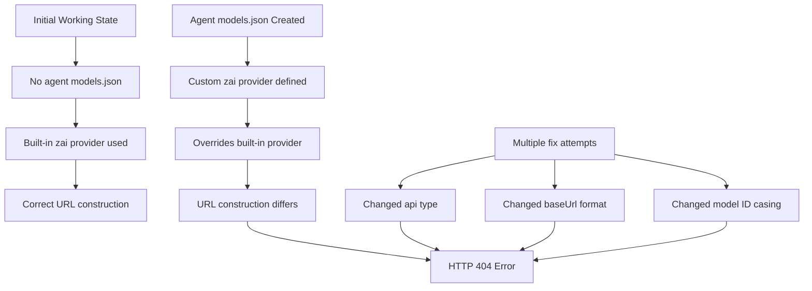

# Z.AI Configuration Comorbidity Analysis

## Root Cause

The built-in `pi-ai` library already has the correct Z.AI configuration:

```javascript
// From node_modules/@mariozechner/pi-ai/dist/models.generated.js
"glm-4.7": {
    id: "glm-4.7",
    api: "openai-completions",      // Correct - uses /chat/completions
    provider: "zai",
    baseUrl: "https://api.z.ai/api/coding/paas/v4",  // Correct endpoint
    ...
}
```

**The problem**: `/home/liam/.clawdbot/agents/main/agent/models.json` was created (did NOT exist at initial commit 31518fd) and contains a custom `zai` provider that OVERRIDES the built-in one.

## Comorbidity Chain



## Related Issues (Checked)

| Component | Status | Issue |
|-----------|--------|-------|
| [.clawdbot/clawdbot.json](.clawdbot/clawdbot.json) | OK | Has correct `env.ZAI_API_KEY` and `zai/glm-4.7` references |
| [.clawdbot/cron/jobs.json](.clawdbot/cron/jobs.json) | OK | Uses `zai/glm-4.7` (lowercase) |
| [.clawdbot/agents/main/agent/models.json](.clawdbot/agents/main/agent/models.json) | **PROBLEM** | Overrides built-in zai provider |
| Built-in pi-ai library | OK | Has correct `glm-4.7` with `openai-completions` API |
| ZAI_API_KEY value | OK | Present and valid (curl test succeeded) |

## The Fix

**Delete the override file**: [.clawdbot/agents/main/agent/models.json](.clawdbot/agents/main/agent/models.json)

This file did not exist in the working state (commit 31518fd). Deleting it will:
1. Remove the custom zai provider override
2. Let clawdbot use the built-in zai provider from pi-ai
3. Use the correct `openai-completions` API type and URL construction

The ollama provider config in this file is redundant - it's already defined in the main [clawdbot.json](.clawdbot/clawdbot.json).

## Verification Steps

After deleting the file:
1. Restart gateway: `systemctl --user restart clawdbot-gateway.service`
2. Verify model discovery: `clawdbot models list | grep zai`
3. Test message to Liam
