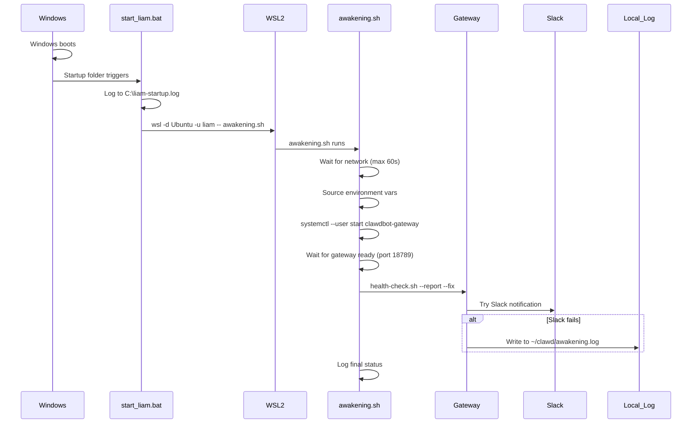

# Windows Reboot Auto-Awakening Plan (APEX Compliant)

## TL;DR

Fix 7 identified failure modes before implementing Windows startup automation. The current setup has blindspots that would cause silent failures on reboot.

## Problem

When Windows restarts (for updates, drivers, GPU updates), WSL2 does not automatically start. The systemd services (`clawdbot-gateway`, `kroko-voice`, `liam-awakens`) only run once WSL2 is active.

## Comorbidity Analysis (APEX Bug Protocol Applied)

| Failure Mode | Severity | Root Cause | Fix |

|--------------|----------|------------|-----|

| **Environment variables not loaded** | Critical | systemd services don't source `.profile` | Add `Environment=` to service files |

| **PATH missing gog/gh** | Critical | `~/.local/bin` not in systemd PATH | Add explicit PATH to services |

| **Network not ready** | High | WSL2 network initializes after boot | Add network wait loop |

| **Slack delivery fails silently** | High | No retry, no fallback | Add retry + local file fallback |

| **Service ordering race** | Medium | Gateway not "listening" when awakens runs | Add readiness check |

| **No logging** | Medium | Startup failures leave no trace | Add Windows + Linux logging |

| **User session not triggered** | Medium | Linger might need explicit trigger | Use `systemctl --user start` |

## Architecture (Fixed)



## Implementation Steps

### Step 1: Fix systemd Service Environment Variables

Update [/home/liam/.config/systemd/user/clawdbot-gateway.service](/home/liam/.config/systemd/user/clawdbot-gateway.service):

```ini
[Service]
Environment="PATH=/home/liam/.local/bin:/usr/local/bin:/usr/bin:/bin"
Environment="GOG_KEYRING_BACKEND=file"
Environment="GOG_KEYRING_PASSWORD=FXCfzyDH/SbRpemXl54gV47coLO3uJBV"
Environment="GOG_ACCOUNT=clawdbot@puenteworks.com"
```

Update [/home/liam/.config/systemd/user/kroko-voice.service](/home/liam/.config/systemd/user/kroko-voice.service):

```ini
[Service]
Environment="LD_LIBRARY_PATH=/home/liam/clawdbot/downloads/onnxruntime-linux-x64-1.17.1/lib"
```

### Step 2: Create Robust Awakening Script

Create `/home/liam/clawd/awakening.sh`:

```bash
#!/bin/bash
# Liam Awakening Script - Handles all edge cases for post-reboot startup
set -o pipefail

LOG="/home/liam/clawd/awakening.log"
MAX_NETWORK_WAIT=60
MAX_GATEWAY_WAIT=30

log() {
    echo "[$(date '+%Y-%m-%d %H:%M:%S')] $1" | tee -a "$LOG"
}

log "=== AWAKENING SEQUENCE STARTED ==="

# 1. Source environment
export PATH="/home/liam/.local/bin:/usr/local/bin:/usr/bin:/bin:$PATH"
export GOG_KEYRING_BACKEND="file"
export GOG_KEYRING_PASSWORD="FXCfzyDH/SbRpemXl54gV47coLO3uJBV"
export GOG_ACCOUNT="clawdbot@puenteworks.com"
log "Environment loaded"

# 2. Wait for network
log "Waiting for network..."
for i in $(seq 1 $MAX_NETWORK_WAIT); do
    if ping -c 1 8.8.8.8 &>/dev/null; then
        log "Network ready after ${i}s"
        break
    fi
    if [ $i -eq $MAX_NETWORK_WAIT ]; then
        log "ERROR: Network timeout after ${MAX_NETWORK_WAIT}s"
    fi
    sleep 1
done

# 3. Ensure systemd user services are running
log "Starting systemd user services..."
systemctl --user start clawdbot-gateway.service
systemctl --user start kroko-voice.service

# 4. Wait for gateway to be ready (listening on port)
log "Waiting for gateway to be ready..."
for i in $(seq 1 $MAX_GATEWAY_WAIT); do
    if ss -tunlp | grep -q ":18789"; then
        log "Gateway ready after ${i}s"
        break
    fi
    if [ $i -eq $MAX_GATEWAY_WAIT ]; then
        log "ERROR: Gateway not ready after ${MAX_GATEWAY_WAIT}s"
    fi
    sleep 1
done

# 5. Run health check with fixes and reporting
log "Running health check..."
cd /home/liam/clawd
bash health-check.sh --report --fix 2>&1 | tee -a "$LOG"

log "=== AWAKENING SEQUENCE COMPLETE ==="
```

### Step 3: Harden health-check.sh

Add retry logic and fallback to [/home/liam/clawd/health-check.sh](/home/liam/clawd/health-check.sh):

```bash
# At the end, replace the Slack send with retry logic:
if [ "$REPORT" = true ]; then
    cd "/home/liam/clawdbot"
    REPORT_HEADER="**Liam has awakened.** System self-check results:"
    if [ $EXIT_CODE -eq 0 ]; then
        SUMMARY="All systems nominal."
    else
        SUMMARY="Issues detected during awakening (Exit $EXIT_CODE)."
    fi
    
    FINAL_MESSAGE="$REPORT_HEADER\n\n$SUMMARY\n\n\`\`\`\n$(echo -e "$OUTPUT" | head -c 3000)\n\`\`\`"
    
    # Retry up to 3 times
    for attempt in 1 2 3; do
        if pnpm run clawdbot message send --message "$FINAL_MESSAGE" --channel last --deliver 2>/dev/null; then
            echo "Slack notification sent (attempt $attempt)"
            break
        fi
        echo "Slack send failed (attempt $attempt), retrying in 10s..."
        sleep 10
    done
    
    # Fallback: Always write to local log
    echo -e "$(date): $FINAL_MESSAGE" >> ~/clawd/awakening.log
fi
```

### Step 4: Update liam-awakens.service

Update [/home/liam/.config/systemd/user/liam-awakens.service](/home/liam/.config/systemd/user/liam-awakens.service):

```ini
[Unit]
Description=Liam Self-Awakening Verification
After=network-online.target clawdbot-gateway.service kroko-voice.service
Wants=clawdbot-gateway.service kroko-voice.service

[Service]
Type=oneshot
ExecStart=/bin/bash /home/liam/clawd/awakening.sh
RemainAfterExit=yes
StandardOutput=append:/home/liam/clawd/awakening.log
StandardError=append:/home/liam/clawd/awakening.log

[Install]
WantedBy=default.target
```

### Step 5: Create Windows Startup Script

Create `C:\Users\Simon\AppData\Roaming\Microsoft\Windows\Start Menu\Programs\Startup\start-liam.bat`:

```batch
@echo off
REM Liam Auto-Awakening for Windows
REM Logs to C:\Users\Simon\liam-startup.log

echo [%date% %time%] Liam startup triggered >> C:\Users\Simon\liam-startup.log

REM Wait 10 seconds for Windows networking to stabilize
timeout /t 10 /nobreak > nul

echo [%date% %time%] Starting WSL2... >> C:\Users\Simon\liam-startup.log
wsl -d Ubuntu -u liam -- /home/liam/clawd/awakening.sh

echo [%date% %time%] WSL2 awakening script completed >> C:\Users\Simon\liam-startup.log
```

## Verification Checklist

After implementing, test with `wsl --shutdown` from PowerShell, then reopen Ubuntu:

- [ ] Gateway starts automatically
- [ ] Kroko.AI starts automatically  
- [ ] Slack notification received within 90 seconds
- [ ] `~/clawd/awakening.log` contains startup trace
- [ ] `C:\Users\Simon\liam-startup.log` shows Windows-side logging
- [ ] GOG auth works (test with `gog auth list --check`)
- [ ] GitHub CLI works (test with `gh auth status`)

## Rollback Plan

If issues occur:

1. Delete `C:\Users\Simon\AppData\Roaming\Microsoft\Windows\Start Menu\Programs\Startup\start-liam.bat`
2. Run `systemctl --user disable liam-awakens.service`
3. Liam will require manual terminal open to start (previous behavior)

## Files Modified

| File | Change |

|------|--------|

| `/home/liam/.config/systemd/user/clawdbot-gateway.service` | Add Environment= vars |

| `/home/liam/.config/systemd/user/kroko-voice.service` | Already has LD_LIBRARY_PATH |

| `/home/liam/.config/systemd/user/liam-awakens.service` | Add proper deps, logging |

| `/home/liam/clawd/awakening.sh` | **NEW** - robust startup script |

| `/home/liam/clawd/health-check.sh` | Add retry + fallback |

| `C:\...\Startup\start-liam.bat` | **NEW** - Windows trigger |

## APEX Compliance Notes

- **Observability**: All failures visible via logs (Windows + Linux)
- **Safe Defaults**: Network timeout gracefully, Slack failure has fallback
- **Non-Destructive**: No data loss on any failure path
- **Error Recovery**: Retry logic for transient failures
- **Regression Guard**: All existing functionality preserved