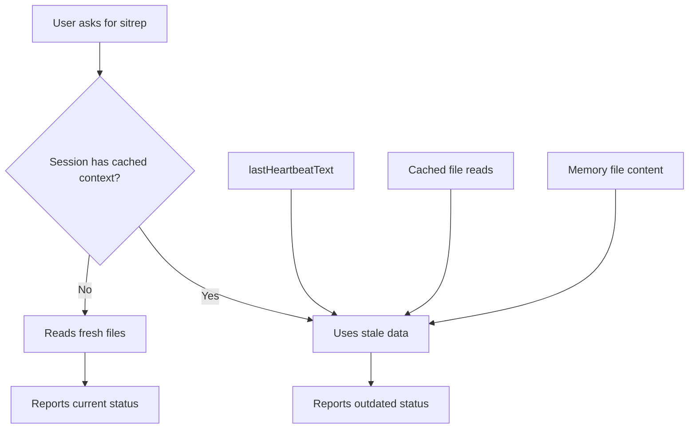

# APEX Session Staleness Prevention

## Problem Analysis

Clawdbot sessions cache data in multiple ways that can become stale:



**Cache layers that cause staleness:**
1. `lastHeartbeatText` in sessions.json - persisted heartbeat responses
2. Session context - files read during conversation are cached
3. Memory files - historical logs misinterpreted as current state

## APEX-Compliant Solutions

### 1. Add Mandatory Re-Read Rule to AGENTS.md

Add a new section after "Every Session" that requires fresh reads before status reports:

```markdown
## Status Reports (CRITICAL)

Before giving ANY status report, sitrep, or system state:
1. **ALWAYS re-read STATUS.md** - never use cached/remembered content
2. **Run actual verification commands** - don't report from memory
3. **Check file modification times** - if unsure, re-read

NEVER say "gog is broken" or "X is blocked" without running the actual check FIRST.
This applies even if you just read the file earlier in this conversation.
```

**File:** [clawd/AGENTS.md](clawd/AGENTS.md)

### 2. Add Session Cleanup Cron Job

Create a daily cron job to clear old sessions (prevents context from getting too stale):

```json
{
  "name": "Session-Cleanup",
  "schedule": { "kind": "cron", "expr": "0 3 * * *", "tz": "America/Los_Angeles" },
  "payload": {
    "kind": "agentTurn",
    "message": "Clear any sessions older than 24 hours to prevent stale context buildup.",
    "model": "ollama/glm-4.7-flash"
  }
}
```

### 3. Enhance HEARTBEAT.md Verification Protocol

Strengthen the existing rule to be more explicit:

```markdown
## CRITICAL: Verify Before Reporting

**ALWAYS run verification commands before reporting status:**

| Status Type | Verification Command |
|-------------|---------------------|
| GOG/Email | `which gog && gog auth list --check` |
| Gateway | `systemctl --user status clawdbot-gateway` |
| Models | `clawdbot models list \| grep -i primary` |

**NEVER report status from:**
- Memory files (memory/*.md)
- Cached session context
- Previous heartbeat responses
- "I remember that X was broken"
```

**File:** [clawd/HEARTBEAT.md](clawd/HEARTBEAT.md)

### 4. Remove lastHeartbeatText Persistence

The `lastHeartbeatText` field in sessions.json should not be used for reporting. Add to AGENTS.md:

```markdown
## Session Cache Warning

The `lastHeartbeatText` field in your session is STALE DATA from a previous run.
NEVER use it to report current status. Always run fresh checks.
```

## Implementation Order

1. Update AGENTS.md with mandatory re-read rule
2. Update HEARTBEAT.md with verification command table
3. Create session cleanup cron job (optional - manual cleanup is also fine)
