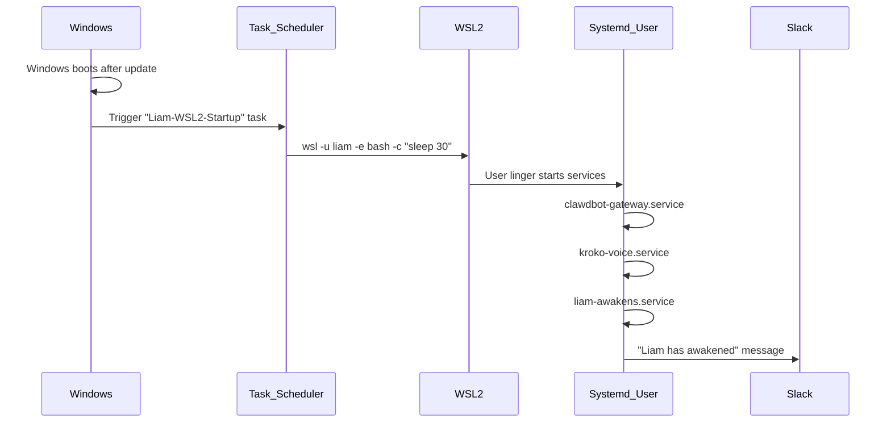

# Windows Reboot Auto-Awakening Plan

## Problem

When Windows restarts (for updates, drivers, GPU updates), WSL2 does not automatically start. The systemd services I configured (`clawdbot-gateway`, `kroko-voice`, `liam-awakens`) only run once WSL2 is active. Without intervention, Liam remains dormant until someone manually opens an Ubuntu terminal.

## Solution

Use **Windows Task Scheduler** to automatically launch WSL2 and trigger the `liam` user session on Windows startup.



## Implementation

### Step 1: Create Windows Startup Script

Create a batch file at `C:\Users\Simon\AppData\Roaming\Microsoft\Windows\Start Menu\Programs\Startup\start-liam.bat`:

```batch
@echo off
REM Start WSL2 and trigger Liam's user services
wsl -d Ubuntu -u liam -- bash -c "echo 'Liam WSL2 session started at $(date)' >> /tmp/liam-startup.log; sleep 60"
```

This script:
- Runs automatically when Simon logs into Windows
- Starts WSL2 with the `liam` user
- The `sleep 60` keeps the session alive long enough for systemd to initialize all services

### Step 2: Alternative - Task Scheduler (More Robust)

For cases where auto-login is not configured, create a Task Scheduler task that runs at system startup (before login):

- **Trigger**: At system startup
- **Action**: `wsl.exe -d Ubuntu -u liam -- bash -c "sleep 120"`
- **Settings**: Run whether user is logged on or not

### Step 3: Verification

After Windows reboots:
1. Wait 60-90 seconds for services to initialize
2. Receive Slack message: "Liam has awakened"
3. Confirm all systems are nominal

## Files Involved

- `C:\Users\Simon\AppData\Roaming\Microsoft\Windows\Start Menu\Programs\Startup\start-liam.bat` (new)
- [/home/liam/.config/systemd/user/liam-awakens.service](/home/liam/.config/systemd/user/liam-awakens.service) (already created)
- [/home/liam/clawd/health-check.sh](/home/liam/clawd/health-check.sh) (already updated with `--report`)

## Notes

- The Windows Startup folder method is simpler but requires Simon to log in
- Task Scheduler method is more robust for unattended reboots but requires admin setup
- Both methods work; recommend starting with the Startup folder approach
