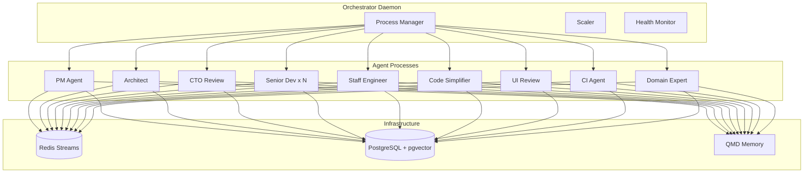

# Multi-Agent SDLC Pipeline Architecture

## Overview

Build a multi-agent software development pipeline where specialized agents (PM, Architect, CTO Review, Senior Dev, Staff Engineer, Code Simplifier, UI Review, CI Agent, Domain Expert) run as **separate Node processes**, communicate via **Redis Streams**, persist state to **PostgreSQL**, and leverage the hooks system for **memory injection**.

## Scope

**In scope:**

- 9 specialized agent roles with distinct responsibilities
- Orchestrator daemon for process lifecycle management
- Redis Streams for durable event-driven communication
- PostgreSQL + pgvector for work items and memory
- QMD-based memory system with hook injection
- Dynamic agent scaling based on queue depth
- Docker Compose for local infrastructure

**Out of scope:**

- Kubernetes deployment (future)
- Multi-tenant isolation
- Custom LLM fine-tuning

## Architecture



## Detailed Phases

### Phase 1: Infrastructure (Tasks 1-2)

- Docker Compose with Redis 7 + PostgreSQL 16 (pgvector)
- Database schema: work_items, agent_runs, pipeline_events, learnings
- Redis Streams wrapper with consumer groups

### Phase 2: Core Framework (Tasks 3-4)

- BaseAgent class with Redis/Postgres connections
- Event types (Zod schemas)
- Orchestrator with process spawning, health checks

### Phase 3: Core Pipeline (Tasks 5-7)

- PM Agent: creates epics from goals
- Architect Agent: adds technical specs
- Senior Dev Agent: TDD implementation

### Phase 4: Review Pipeline (Tasks 8-9)

- CTO Review + Staff Engineer (Carmack review)
- Code Simplifier (anti-slop gate)

### Phase 5: CI/Visual (Tasks 10-11)

- UI Review Agent (Playwright screenshots)
- CI Agent (PR creation, CI monitoring)

### Phase 6: Memory System (Tasks 12-13)

- QMD integration via hooks
- Bootstrap from CLAUDE.md + git history

### Phase 7: Domain + Docs (Tasks 14-15)

- Domain Expert Agent with RAG
- Documentation and CLI commands

## Alternatives Considered

| Option            | Pros                     | Cons                            | Decision    |
| ----------------- | ------------------------ | ------------------------------- | ----------- |
| In-process agents | Simpler                  | Can't scale, crash affects all  | ❌ Rejected |
| Redis Pub/Sub     | Simpler                  | Fire-and-forget, no persistence | ❌ Rejected |
| **Redis Streams** | Durable, consumer groups | Slightly complex                | ✅ Chosen   |
| Temporal          | Battle-tested workflows  | Heavy dependency                | ⏸️ Future   |

## Non-Functional Targets

- **Latency**: Agent handoff < 500ms
- **Reliability**: Auto-restart crashed agents within 5s
- **Scalability**: 1-10 Senior Dev instances dynamically
- **Memory**: QMD retrieval < 100ms

## Risks & Mitigations

| Risk                   | Impact            | Mitigation                            |
| ---------------------- | ----------------- | ------------------------------------- |
| Agent claims same work | Duplicate work    | Redis XREADGROUP with consumer groups |
| Work stuck in_progress | Queue backup      | Timeout + orphan detection            |
| Orchestrator crash     | Pipeline orphaned | systemd/launchd auto-restart          |
| Redis connection lost  | Events lost       | Streams persist + reconnect logic     |

## Rollout Plan

1. **Alpha**: Local Docker only, manual testing
2. **Beta**: Feature flag `OPENCLAW_MULTI_AGENT=1`
3. **GA**: Default enabled, docs published

## Rollback Plan

- Disable feature flag to revert to single-agent mode
- No schema migrations that break backwards compatibility

## Quick commands

```bash
# Start infrastructure
docker compose -f docker-compose.pipeline.yml up -d

# Run orchestrator (dev)
pnpm orchestrator:dev

# Check agent health
pnpm openclaw orchestrator status

# Run tests
pnpm test src/orchestrator src/agents/roles

# E2E test
pnpm test:e2e:pipeline
```

## Acceptance

- [ ] All 9 agent roles implemented and tested
- [ ] Orchestrator spawns/monitors/restarts agents
- [ ] Redis Streams handles 100 events/sec
- [ ] PostgreSQL tracks work items with status transitions
- [ ] QMD memory injection via hooks working
- [ ] Dynamic scaling based on queue depth
- [ ] Docker Compose one-command setup
- [ ] Documentation published

## References

- Prior art: CrewAI, MetaGPT, OpenAI Swarm
- Memory: Mem0, QMD patterns
- Process mgmt: PM2 internals
- Existing code: `src/hooks/claude-style/`, `src/daemon/`, `src/infra/agent-events.ts`
