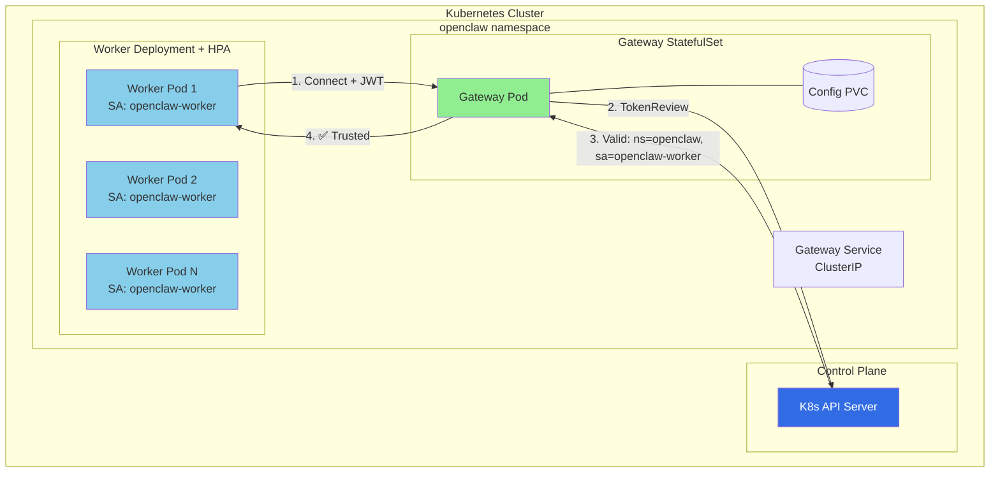
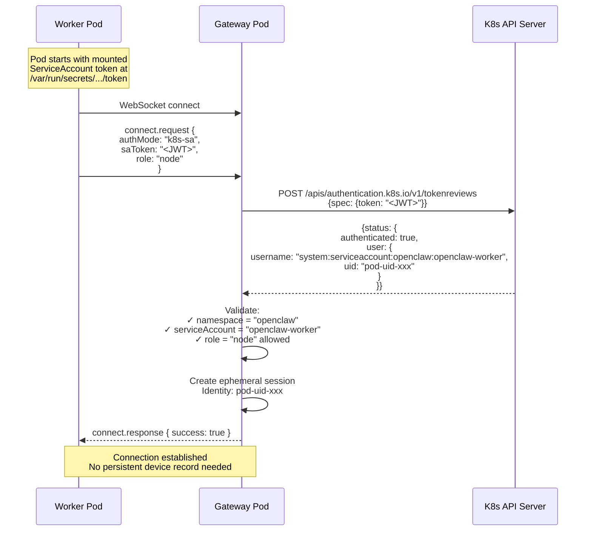
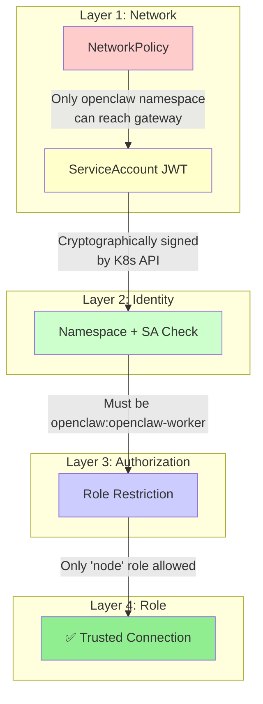
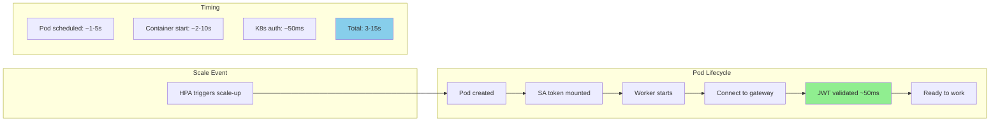

# OpenClaw Kubernetes: Service Account Trust Architecture

**Target:** Production Kubernetes with HorizontalPodAutoscaler  
**Security Model:** Kubernetes Service Account Trust (Zero shared secrets)

---

## Design Principles

1. **No shared secrets** - Use K8s-native identity (ServiceAccount tokens)
2. **Zero-trust networking** - Validate every connection, even from pod network
3. **Least privilege** - Workers get only "node" role capabilities
4. **Automatic revocation** - Pod deletion = immediate access revocation
5. **Auditable** - Every connection traceable to specific pod

---

## Architecture



---

## Authentication Flow



---

## Security Model

### Trust Chain



### Why This Is Secure

| Property                   | How SA Trust Achieves It                           |
| -------------------------- | -------------------------------------------------- |
| **No shared secrets**      | Each pod has unique, auto-rotated JWT              |
| **Cryptographic identity** | JWT signed by K8s CA, unforgeable                  |
| **Automatic rotation**     | K8s rotates tokens automatically (default: 1 hour) |
| **Instant revocation**     | Pod deletion = token immediately invalid           |
| **Per-pod tracking**       | Each connection maps to specific pod UID           |
| **Namespace isolation**    | Can only trust specific namespace(s)               |
| **Defense in depth**       | NetworkPolicy + JWT + namespace + SA + role        |

### Attack Scenarios

| Attack                       | Mitigation                                          |
| ---------------------------- | --------------------------------------------------- |
| Token stolen from pod        | Token only valid from that pod's IP (K8s binding)   |
| Compromised pod connects     | Valid - but traceable, and limited to "node" role   |
| Pod impersonates another     | JWT contains pod UID - can't forge                  |
| External attacker with token | NetworkPolicy blocks, JWT audience wrong            |
| Replay old token             | Tokens expire (1 hour default), API rejects expired |
| MITM in cluster              | Use mTLS (optional enhancement)                     |

---

## Implementation

### Gateway Config

```yaml
# openclaw.json
{
  "gateway":
    {
      "mode": "local",
      "port": 18789,
      "bind": "lan",
      "auth": { "mode": "token", "token": "${OPENCLAW_GATEWAY_TOKEN}" },
      "k8sAuth":
        {
          "enabled": true,
          "apiServer": "https://kubernetes.default.svc",
          "caCertPath": "/var/run/secrets/kubernetes.io/serviceaccount/ca.crt",
          "tokenPath": "/var/run/secrets/kubernetes.io/serviceaccount/token",
          "allowedIdentities":
            [
              {
                "namespace": "openclaw",
                "serviceAccount": "openclaw-worker",
                "allowedRoles": ["node"],
              },
            ],
          "ephemeralSessions": true,
          "auditLog": true,
        },
    },
}
```

### Code: Gateway K8s Auth Module

```typescript
// src/gateway/k8s-auth.ts

import { readFileSync } from "fs";

interface K8sAuthConfig {
  enabled: boolean;
  apiServer: string;
  caCertPath: string;
  tokenPath: string;
  allowedIdentities: AllowedIdentity[];
  ephemeralSessions?: boolean;
  auditLog?: boolean;
}

interface AllowedIdentity {
  namespace: string;
  serviceAccount: string;
  allowedRoles: string[];
}

interface TokenReviewResult {
  authenticated: boolean;
  namespace?: string;
  serviceAccount?: string;
  podUid?: string;
  error?: string;
}

export class K8sAuthenticator {
  private config: K8sAuthConfig;
  private caCert: string;
  private gatewayToken: string;

  constructor(config: K8sAuthConfig) {
    this.config = config;
    this.caCert = readFileSync(config.caCertPath, "utf8");
    this.gatewayToken = readFileSync(config.tokenPath, "utf8").trim();
  }

  async validateToken(saToken: string): Promise<TokenReviewResult> {
    const response = await fetch(
      `${this.config.apiServer}/apis/authentication.k8s.io/v1/tokenreviews`,
      {
        method: "POST",
        headers: {
          Authorization: `Bearer ${this.gatewayToken}`,
          "Content-Type": "application/json",
        },
        body: JSON.stringify({
          apiVersion: "authentication.k8s.io/v1",
          kind: "TokenReview",
          spec: { token: saToken },
        }),
        // In real impl, configure CA cert for TLS
      },
    );

    const result = await response.json();

    if (!result.status?.authenticated) {
      return { authenticated: false, error: "Token not authenticated" };
    }

    // Parse username: "system:serviceaccount:NAMESPACE:SA_NAME"
    const username = result.status.user?.username || "";
    const parts = username.split(":");

    if (parts.length !== 4 || parts[0] !== "system" || parts[1] !== "serviceaccount") {
      return { authenticated: false, error: "Not a ServiceAccount token" };
    }

    return {
      authenticated: true,
      namespace: parts[2],
      serviceAccount: parts[3],
      podUid: result.status.user?.uid,
    };
  }

  isIdentityAllowed(namespace: string, serviceAccount: string, requestedRole: string): boolean {
    return this.config.allowedIdentities.some(
      (identity) =>
        identity.namespace === namespace &&
        identity.serviceAccount === serviceAccount &&
        identity.allowedRoles.includes(requestedRole),
    );
  }
}
```

### Code: Connection Handler Integration

```typescript
// src/gateway/server/ws-connection/message-handler.ts

async function handleConnect(req: ConnectRequest, ctx: ConnectionContext) {
  // K8s ServiceAccount authentication
  if (req.authMode === "k8s-sa" && config.k8sAuth?.enabled) {
    const k8sAuth = getK8sAuthenticator();

    // Validate JWT with K8s API
    const tokenResult = await k8sAuth.validateToken(req.saToken);

    if (!tokenResult.authenticated) {
      return rejectConnection(ctx, "k8s-auth-failed", tokenResult.error);
    }

    // Check if this identity is allowed
    if (!k8sAuth.isIdentityAllowed(tokenResult.namespace!, tokenResult.serviceAccount!, req.role)) {
      return rejectConnection(
        ctx,
        "k8s-identity-not-allowed",
        `${tokenResult.namespace}:${tokenResult.serviceAccount} not allowed for role ${req.role}`,
      );
    }

    // Audit log
    if (config.k8sAuth.auditLog) {
      logger.info("k8s-auth-success", {
        namespace: tokenResult.namespace,
        serviceAccount: tokenResult.serviceAccount,
        podUid: tokenResult.podUid,
        role: req.role,
        remoteIp: ctx.remoteAddress,
      });
    }

    // Create ephemeral session (not persisted to devices/*.json)
    return createEphemeralSession(ctx, {
      identity: `k8s:${tokenResult.namespace}:${tokenResult.serviceAccount}:${tokenResult.podUid}`,
      role: req.role,
      displayName: req.displayName || `Worker ${tokenResult.podUid?.slice(0, 8)}`,
    });
  }

  // Fall through to existing device pairing for non-K8s clients
  // ...
}
```

### Code: Node Client Changes

```typescript
// src/node-host/runner.ts

interface NodeRunOptions {
  host: string;
  port: number;
  displayName?: string;
  // NEW
  k8sAuth?: boolean;
  saTokenPath?: string;
}

async function runNodeHost(options: NodeRunOptions) {
  let authConfig: AuthConfig;

  if (options.k8sAuth) {
    // Read ServiceAccount token from mounted path
    const saTokenPath =
      options.saTokenPath || "/var/run/secrets/kubernetes.io/serviceaccount/token";
    const saToken = readFileSync(saTokenPath, "utf8").trim();

    authConfig = {
      mode: "k8s-sa",
      saToken,
    };
  } else {
    // Existing device identity auth
    authConfig = {
      mode: "device",
      deviceIdentity: await loadOrCreateDeviceIdentity(),
    };
  }

  const client = new GatewayClient({
    url: `ws://${options.host}:${options.port}`,
    role: "node",
    displayName: options.displayName,
    auth: authConfig,
  });

  // Token refresh loop (K8s rotates tokens)
  if (options.k8sAuth) {
    setInterval(
      async () => {
        const newToken = readFileSync(saTokenPath, "utf8").trim();
        client.updateAuthToken(newToken);
      },
      5 * 60 * 1000,
    ); // Refresh every 5 minutes
  }

  await client.start();
}
```

### CLI Changes

```typescript
// src/commands/node.ts

.command('run')
.option('--host <host>', 'Gateway host')
.option('--port <port>', 'Gateway port')
.option('--display-name <name>', 'Worker display name')
// NEW
.option('--k8s-auth', 'Use Kubernetes ServiceAccount authentication')
.option('--sa-token-path <path>', 'Path to ServiceAccount token',
  '/var/run/secrets/kubernetes.io/serviceaccount/token')
```

---

## Kubernetes Manifests

### Namespace

```yaml
apiVersion: v1
kind: Namespace
metadata:
  name: openclaw
  labels:
    name: openclaw # For NetworkPolicy selectors
```

### ServiceAccounts

```yaml
# Gateway ServiceAccount (needs TokenReview permissions)
apiVersion: v1
kind: ServiceAccount
metadata:
  name: openclaw-gateway
  namespace: openclaw
---
# Worker ServiceAccount (minimal permissions)
apiVersion: v1
kind: ServiceAccount
metadata:
  name: openclaw-worker
  namespace: openclaw
```

### RBAC: Gateway Permissions

```yaml
apiVersion: rbac.authorization.k8s.io/v1
kind: ClusterRole
metadata:
  name: openclaw-token-reviewer
rules:
  - apiGroups: ["authentication.k8s.io"]
    resources: ["tokenreviews"]
    verbs: ["create"]
---
apiVersion: rbac.authorization.k8s.io/v1
kind: ClusterRoleBinding
metadata:
  name: openclaw-gateway-token-reviewer
subjects:
  - kind: ServiceAccount
    name: openclaw-gateway
    namespace: openclaw
roleRef:
  kind: ClusterRole
  name: openclaw-token-reviewer
  apiGroup: rbac.authorization.k8s.io
```

### Gateway StatefulSet

```yaml
apiVersion: apps/v1
kind: StatefulSet
metadata:
  name: openclaw-gateway
  namespace: openclaw
spec:
  serviceName: openclaw-gateway
  replicas: 1
  selector:
    matchLabels:
      app: openclaw-gateway
  template:
    metadata:
      labels:
        app: openclaw-gateway
    spec:
      serviceAccountName: openclaw-gateway
      containers:
        - name: gateway
          image: openclaw:latest
          args:
            - gateway
            - --bind
            - lan
            - --port
            - "18789"
          env:
            - name: OPENCLAW_GATEWAY_TOKEN
              valueFrom:
                secretKeyRef:
                  name: openclaw-user-auth
                  key: token
          ports:
            - containerPort: 18789
              name: gateway
          volumeMounts:
            - name: config
              mountPath: /home/node/.openclaw/openclaw.json
              subPath: openclaw.json
          livenessProbe:
            httpGet:
              path: /
              port: 18789
            initialDelaySeconds: 10
          readinessProbe:
            httpGet:
              path: /
              port: 18789
            initialDelaySeconds: 5
          resources:
            requests:
              cpu: 100m
              memory: 256Mi
            limits:
              cpu: 500m
              memory: 512Mi
      volumes:
        - name: config
          configMap:
            name: openclaw-gateway-config
  volumeClaimTemplates:
    - metadata:
        name: data
      spec:
        accessModes: ["ReadWriteOnce"]
        resources:
          requests:
            storage: 1Gi
```

### Worker Deployment + HPA

```yaml
apiVersion: apps/v1
kind: Deployment
metadata:
  name: openclaw-workers
  namespace: openclaw
spec:
  replicas: 2
  selector:
    matchLabels:
      app: openclaw-worker
  template:
    metadata:
      labels:
        app: openclaw-worker
    spec:
      serviceAccountName: openclaw-worker
      containers:
        - name: worker
          image: openclaw:latest
          args:
            - node
            - run
            - --host
            - openclaw-gateway
            - --port
            - "18789"
            - --k8s-auth
            - --display-name
            - "$(POD_NAME)"
          env:
            - name: POD_NAME
              valueFrom:
                fieldRef:
                  fieldPath: metadata.name
            - name: OPENCLAW_GATEWAY_TOKEN
              valueFrom:
                secretKeyRef:
                  name: openclaw-user-auth
                  key: token
          resources:
            requests:
              cpu: 100m
              memory: 256Mi
            limits:
              cpu: 1000m
              memory: 1Gi
      # Pod anti-affinity for HA
      affinity:
        podAntiAffinity:
          preferredDuringSchedulingIgnoredDuringExecution:
            - weight: 100
              podAffinityTerm:
                labelSelector:
                  matchLabels:
                    app: openclaw-worker
                topologyKey: kubernetes.io/hostname
---
apiVersion: autoscaling/v2
kind: HorizontalPodAutoscaler
metadata:
  name: openclaw-workers
  namespace: openclaw
spec:
  scaleTargetRef:
    apiVersion: apps/v1
    kind: Deployment
    name: openclaw-workers
  minReplicas: 2
  maxReplicas: 50
  metrics:
    - type: Resource
      resource:
        name: cpu
        target:
          type: Utilization
          averageUtilization: 70
  behavior:
    scaleDown:
      stabilizationWindowSeconds: 300 # 5 min cooldown
      policies:
        - type: Percent
          value: 10
          periodSeconds: 60
    scaleUp:
      stabilizationWindowSeconds: 0 # Scale up immediately
      policies:
        - type: Percent
          value: 100
          periodSeconds: 15
```

### Service

```yaml
apiVersion: v1
kind: Service
metadata:
  name: openclaw-gateway
  namespace: openclaw
spec:
  selector:
    app: openclaw-gateway
  ports:
    - port: 18789
      targetPort: 18789
      name: gateway
  type: ClusterIP
```

### ConfigMap

```yaml
apiVersion: v1
kind: ConfigMap
metadata:
  name: openclaw-gateway-config
  namespace: openclaw
data:
  openclaw.json: |
    {
      "gateway": {
        "mode": "local",
        "port": 18789,
        "bind": "lan",
        "auth": {
          "mode": "token"
        },
        "k8sAuth": {
          "enabled": true,
          "apiServer": "https://kubernetes.default.svc",
          "caCertPath": "/var/run/secrets/kubernetes.io/serviceaccount/ca.crt",
          "tokenPath": "/var/run/secrets/kubernetes.io/serviceaccount/token",
          "allowedIdentities": [
            {
              "namespace": "openclaw",
              "serviceAccount": "openclaw-worker",
              "allowedRoles": ["node"]
            }
          ],
          "ephemeralSessions": true,
          "auditLog": true
        }
      }
    }
```

### NetworkPolicy

```yaml
apiVersion: networking.k8s.io/v1
kind: NetworkPolicy
metadata:
  name: openclaw-gateway-ingress
  namespace: openclaw
spec:
  podSelector:
    matchLabels:
      app: openclaw-gateway
  policyTypes:
    - Ingress
  ingress:
    # Allow from workers in same namespace
    - from:
        - podSelector:
            matchLabels:
              app: openclaw-worker
      ports:
        - protocol: TCP
          port: 18789
    # Allow from ingress controller (for external access)
    - from:
        - namespaceSelector:
            matchLabels:
              kubernetes.io/metadata.name: ingress-nginx
      ports:
        - protocol: TCP
          port: 18789
---
apiVersion: networking.k8s.io/v1
kind: NetworkPolicy
metadata:
  name: openclaw-worker-egress
  namespace: openclaw
spec:
  podSelector:
    matchLabels:
      app: openclaw-worker
  policyTypes:
    - Egress
  egress:
    # Allow to gateway
    - to:
        - podSelector:
            matchLabels:
              app: openclaw-gateway
      ports:
        - protocol: TCP
          port: 18789
    # Allow DNS
    - to:
        - namespaceSelector: {}
          podSelector:
            matchLabels:
              k8s-app: kube-dns
      ports:
        - protocol: UDP
          port: 53
```

### User Auth Secret (for external clients)

```yaml
apiVersion: v1
kind: Secret
metadata:
  name: openclaw-user-auth
  namespace: openclaw
type: Opaque
stringData:
  token: "your-secure-gateway-token-here"
```

---

## Monitoring & Observability

### Prometheus Metrics (Gateway)

```typescript
// Metrics to expose
const k8sAuthAttempts = new Counter({
  name: "openclaw_k8s_auth_attempts_total",
  help: "K8s auth attempts",
  labelNames: ["namespace", "service_account", "result"],
});

const activeK8sSessions = new Gauge({
  name: "openclaw_k8s_sessions_active",
  help: "Active K8s-authenticated sessions",
  labelNames: ["namespace", "service_account"],
});
```

### Grafana Dashboard Queries

```promql
# Auth success rate
rate(openclaw_k8s_auth_attempts_total{result="success"}[5m])
/ rate(openclaw_k8s_auth_attempts_total[5m])

# Active workers by namespace
openclaw_k8s_sessions_active

# Failed auth attempts (alert worthy)
increase(openclaw_k8s_auth_attempts_total{result="failed"}[5m]) > 0
```

### Audit Log Format

```json
{
  "timestamp": "2026-02-08T12:00:00Z",
  "event": "k8s-auth-success",
  "namespace": "openclaw",
  "serviceAccount": "openclaw-worker",
  "podUid": "abc123-def456",
  "role": "node",
  "remoteIp": "10.244.1.5",
  "displayName": "openclaw-workers-7b8c9-xkl2m"
}
```

---

## Scaling Characteristics



**Key Scaling Properties:**

- New workers ready in **3-15 seconds** (dominated by pod scheduling)
- **Zero pre-registration** - JWT is the identity
- **Linear scaling** - No gateway state per worker needed
- **Graceful scale-down** - Sessions cleaned when pod terminates

---

## Comparison: SA Trust vs Device Pairing

| Aspect           | Device Pairing             | K8s SA Trust                |
| ---------------- | -------------------------- | --------------------------- |
| Identity source  | Generated keypair          | K8s ServiceAccount          |
| Persistence      | Required (devices/\*.json) | None (ephemeral)            |
| Revocation       | Manual approval removal    | Automatic on pod delete     |
| Scaling          | Manual approve each        | Zero-touch                  |
| Blast radius     | Per-device                 | Per-pod                     |
| Rotation         | Manual                     | Automatic (K8s handles)     |
| Audit trail      | Device ID                  | Pod UID + namespace + SA    |
| External clients | ✅ Supported               | ❌ K8s only                 |
| Complexity       | Lower                      | Higher (K8s API dependency) |

---

## Summary

**K8s ServiceAccount Trust is the production-recommended approach for Kubernetes deployments because:**

1. ✅ **No shared secrets** - Eliminates secret management overhead
2. ✅ **Automatic rotation** - K8s handles token lifecycle
3. ✅ **Instant revocation** - Pod deletion = immediate access loss
4. ✅ **Per-pod identity** - Full audit trail to specific workload
5. ✅ **Zero-touch scaling** - HPA works without any manual steps
6. ✅ **K8s-native** - Leverages existing RBAC and identity infrastructure
7. ✅ **Defense in depth** - NetworkPolicy + JWT + namespace + SA + role

**Implementation effort:** ~200 lines of code + K8s manifests  
**Time to production:** Ready for workers in 3-15 seconds after scale event
