# Telegram Integration Architecture

## Executive Summary

This document provides architectural guidance for adding Telegram as a third messaging provider to warelay. Like the WhatsApp Web provider, Telegram uses the user's personal account via **MTProto client** for 1-on-1 conversation automation.

**Key architecture decisions:**

1. **MTProto client**: Users log in with their personal Telegram account (phone + 2FA)
2. **Same security model**: `allowFrom` whitelist controls who can trigger auto-replies
3. **Provider abstraction**: Unified interface across Twilio, Web, and Telegram providers
4. **Session storage**: File-based session like WhatsApp Web (`~/.clawdis/telegram/session/`)

---

## Table of Contents

1. [Current Provider Architecture](#1-current-provider-architecture)
2. [Provider Analysis: Web vs Telegram](#2-provider-analysis-web-vs-telegram)
3. [Telegram MTProto Design](#3-telegram-mtproto-design)
4. [Provider Abstraction Improvements](#4-provider-abstraction-improvements)
5. [Configuration Schema Design](#5-configuration-schema-design)
6. [Implementation Roadmap](#6-implementation-roadmap)
7. [User Experience Design](#7-user-experience-design)
8. [Design Decisions](#8-design-decisions)

---

## 1. Current Provider Architecture

### 1.1 System Context

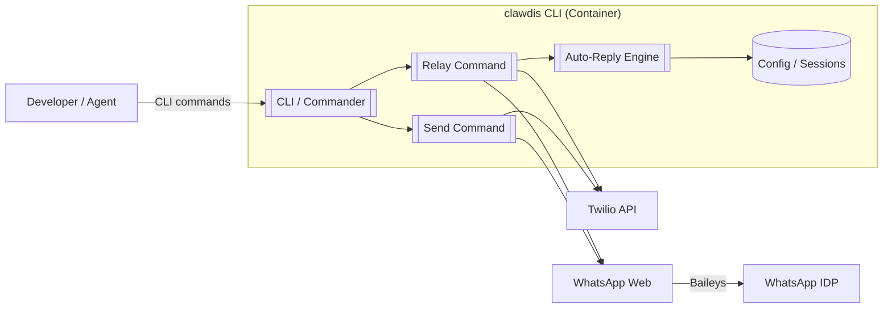

**Caption:** clawdis system context showing CLI entry points and provider connections.

**Evidence:** `src/cli/program.ts:L1-L50`, `src/commands/send.ts:L1-L150`

### 1.2 Current Provider Type Definition

The provider abstraction is currently a simple type union:

```typescript
// src/utils.ts:L9
export type Provider = "wa-twilio" | "wa-web";

// src/utils.ts:L11-L14
export function assertProvider(input: string): asserts input is Provider {
  if (input !== "wa-twilio" && input !== "wa-web") {
    throw new Error("Provider must be 'wa-twilio' or 'wa-web'");
  }
}
```

**Evidence:** `src/utils.ts:L9-L14`

**Interpretation:** There is no formal provider interface or contract. Each provider has its own module structure with different function signatures.

### 1.3 Provider Module Structure

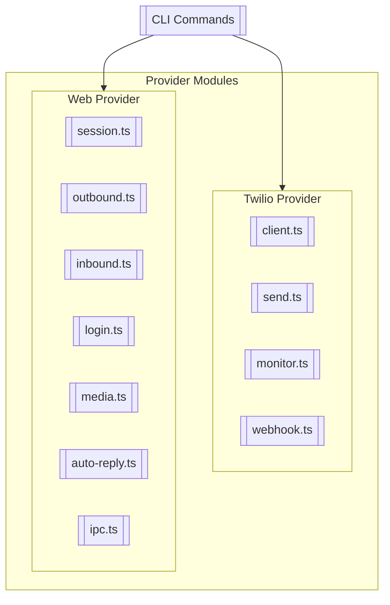

**Caption:** Current provider module organization showing asymmetric implementations.

**Evidence:**
- Twilio: `src/providers/twilio/index.ts`, `src/twilio/*.ts`
- Web: `src/providers/web/index.ts`, `src/web/*.ts`, `src/provider-web.ts`

### 1.4 Provider Selection Logic

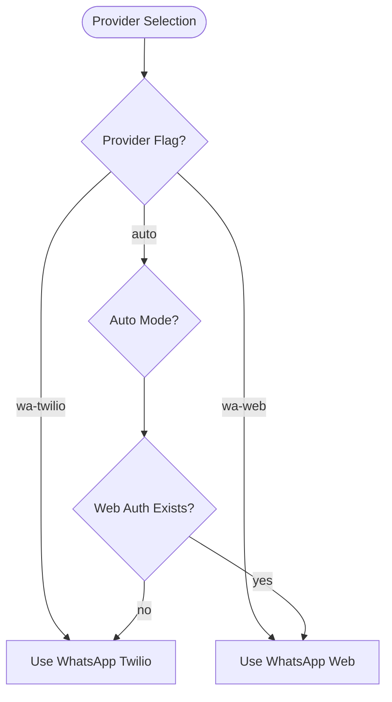

**Caption:** Provider auto-selection prioritizes Web when credentials exist.

**Evidence:** `src/web/session.ts:L220-L226`

```typescript
export async function pickProvider(pref: Provider | "auto"): Promise<Provider> {
  if (pref !== "auto") return pref;
  const hasWeb = await webAuthExists();
  if (hasWeb) return "wa-web";
  return "wa-twilio";
}
```

---

## 2. Provider Analysis: Web vs Telegram

### 2.1 Comparison Matrix

| Aspect | WhatsApp Web Provider | Telegram MTProto Provider |
|--------|----------------------|---------------------------|
| **Auth Model** | QR code scan | Phone + code + 2FA |
| **Connection Type** | Persistent WebSocket | Persistent TCP/WebSocket |
| **Library** | Baileys | GramJS |
| **Session Storage** | `~/.clawdis/credentials/` | `~/.clawdis/telegram/session/` |
| **Message Send** | Socket message | MTProto request |
| **Inbound Handling** | Event listener | Event listener |
| **Delivery Status** | Limited (receipts) | Full (receipts + read) |
| **Media Handling** | Buffer-based | Buffer-based |
| **Session Management** | Multi-file auth state | String session |
| **Reconnection** | Exponential backoff | Exponential backoff |

### 2.2 Web Provider Architecture

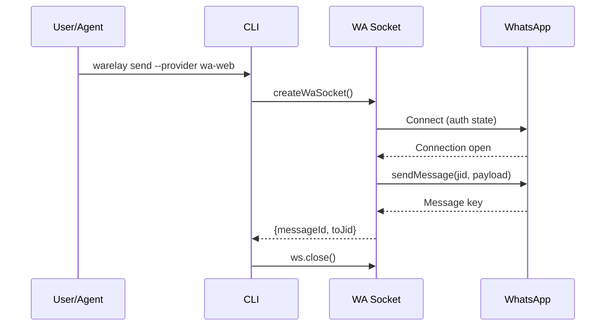

**Caption:** Web send flow using persistent Baileys socket.

**Evidence:** `src/web/outbound.ts:L12-L65`

**Key characteristics:**
- Persistent connection with session state
- QR-based authentication stored at `~/.clawdis/credentials/`
- Media sent as buffers with automatic optimization
- IPC server for relay mode to prevent session corruption

### 2.3 Telegram MTProto Architecture (Proposed)

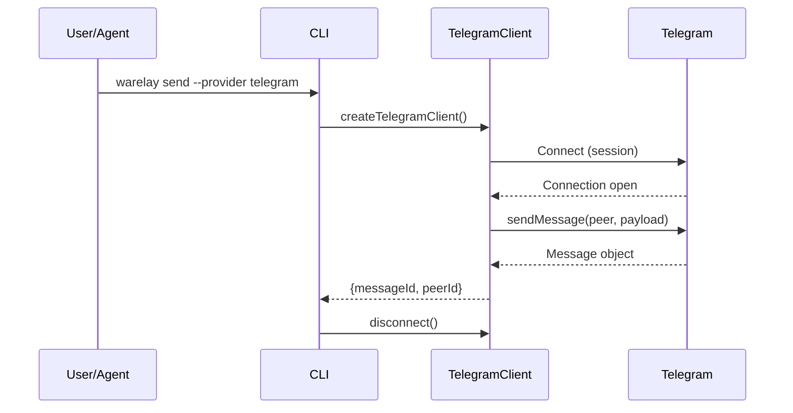

**Caption:** Telegram send flow using GramJS MTProto client.

**Key characteristics:**
- Persistent connection with session state (like WhatsApp Web)
- Phone-based authentication stored at `~/.clawdis/telegram/session/`
- Media sent as buffers
- Same patterns as Baileys for session management

### 2.4 Inbound Message Handling

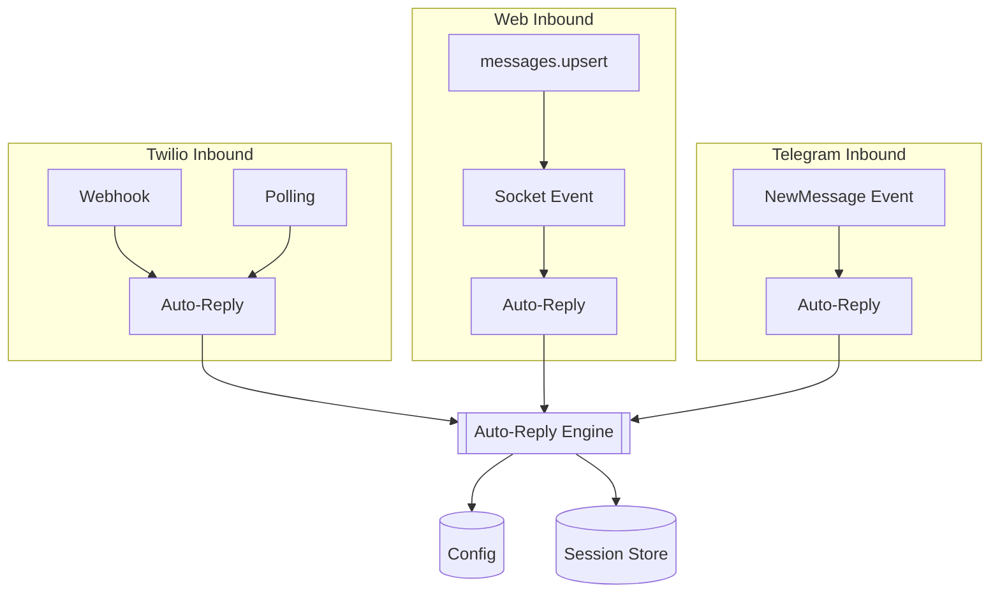

**Caption:** All providers converge at the provider-agnostic auto-reply engine.

**Evidence:**
- Twilio: `src/twilio/monitor.ts:L52-L101`
- Web: `src/web/inbound.ts:L43-L274`

---

## 3. Telegram MTProto Design

### 3.1 MTProto Client Architecture

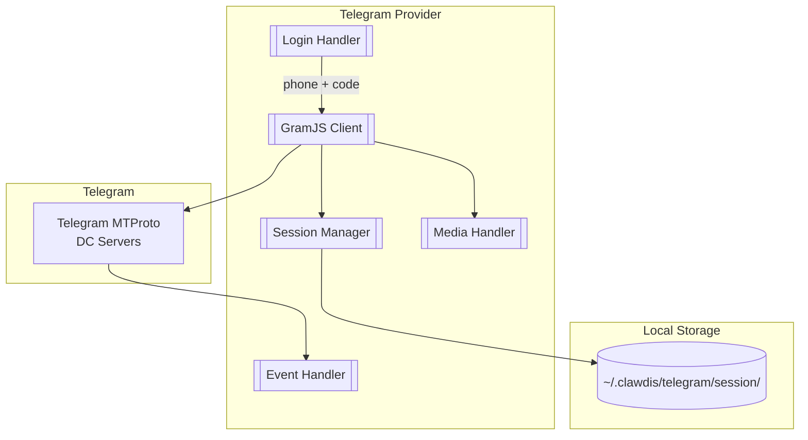

**Caption:** Telegram provider internal architecture using MTProto.

### 3.2 Telegram Login Flow

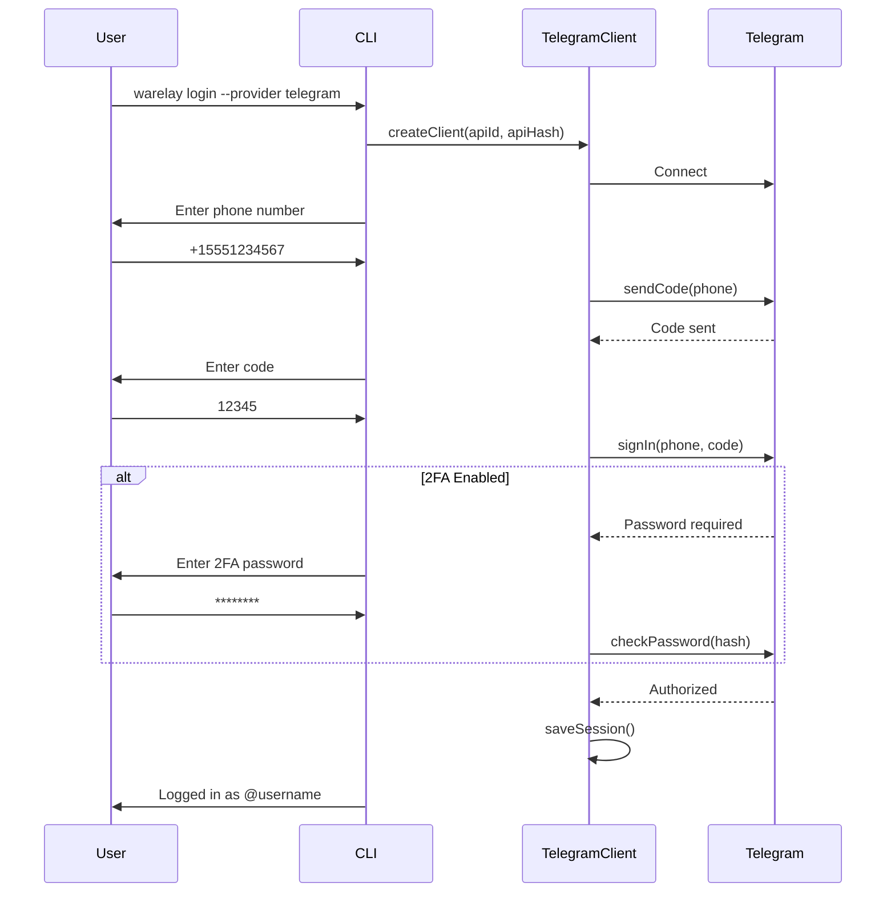

**Caption:** Interactive Telegram login flow with optional 2FA.

### 3.3 Telegram Send Flow

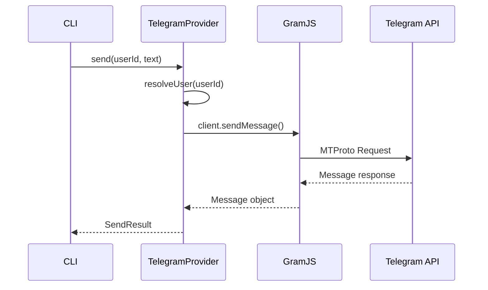

**Caption:** Telegram outbound message sequence.

### 3.4 Telegram Relay Flow

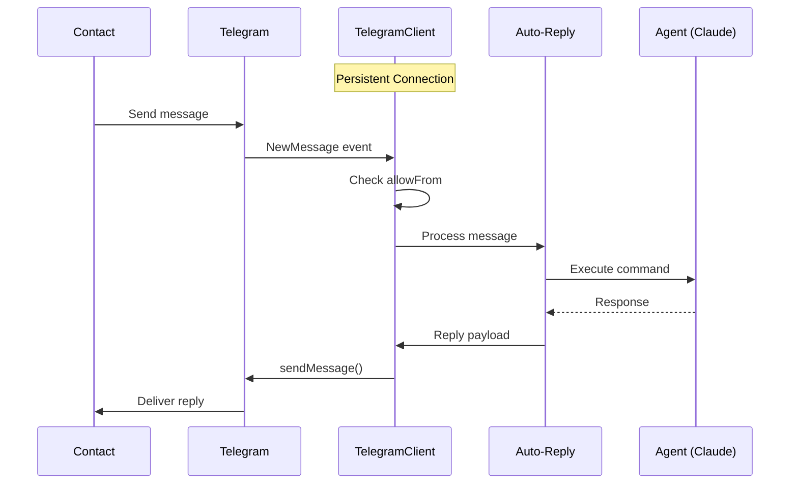

**Caption:** Telegram relay mode with auto-reply using persistent connection.

### 3.5 Security Model

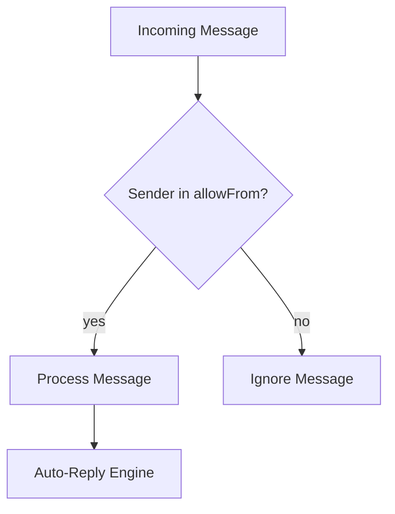

**Caption:** `allowFrom` whitelist filtering for Telegram (same as WhatsApp).

**Configuration:**
```json5
{
  telegram: {
    allowFrom: ["@alice", "@bob", "123456789"]
  }
}
```

- Usernames must include `@` prefix
- User IDs are numeric strings
- Empty array `[]` blocks all
- Omit entirely to allow all (use with caution)

---

## 4. Provider Abstraction Improvements

### 4.1 Proposed Provider Interface

```typescript
// src/providers/types.ts (proposed)

export type ProviderKind = "wa-twilio" | "wa-web" | "telegram";

export interface ProviderMessage {
  id: string;
  from: string;           // Normalized identifier
  to: string;             // Normalized identifier
  body: string;
  timestamp: number;
  media?: ProviderMedia[];
  raw?: unknown;          // Provider-specific payload
}

export interface ProviderMedia {
  type: "image" | "video" | "audio" | "document" | "voice";
  url?: string;           // Remote URL
  buffer?: Buffer;        // Local buffer
  mimeType?: string;
  fileName?: string;
  size?: number;
}

export interface SendOptions {
  media?: ProviderMedia[];
  replyTo?: string;       // Message ID to reply to
  typing?: boolean;       // Send typing indicator first
}

export interface SendResult {
  messageId: string;
  status: "sent" | "queued" | "failed";
  providerMeta?: unknown; // Provider-specific (SID, user_id, etc.)
}

export interface DeliveryStatus {
  messageId: string;
  status: "sent" | "delivered" | "read" | "failed" | "unknown";
  timestamp?: number;
  error?: string;
}

export interface ProviderCapabilities {
  supportsDeliveryReceipts: boolean;
  supportsReadReceipts: boolean;
  supportsTypingIndicator: boolean;
  supportsReactions: boolean;
  supportsReplies: boolean;
  supportsEditing: boolean;
  supportsDeleting: boolean;
  maxMediaSize: number;
  supportedMediaTypes: string[];
  canInitiateConversation: boolean;
}

export interface Provider {
  readonly kind: ProviderKind;
  readonly capabilities: ProviderCapabilities;

  // Lifecycle
  initialize(config: ProviderConfig): Promise<void>;
  isConnected(): boolean;
  disconnect(): Promise<void>;

  // Outbound
  send(to: string, body: string, options?: SendOptions): Promise<SendResult>;
  sendTyping(to: string): Promise<void>;

  // Inbound (relay mode)
  onMessage(handler: (msg: ProviderMessage) => Promise<void>): void;
  startListening(): Promise<void>;
  stopListening(): Promise<void>;

  // Status (optional)
  getDeliveryStatus?(messageId: string): Promise<DeliveryStatus>;
}
```

### 4.2 Provider Factory Pattern

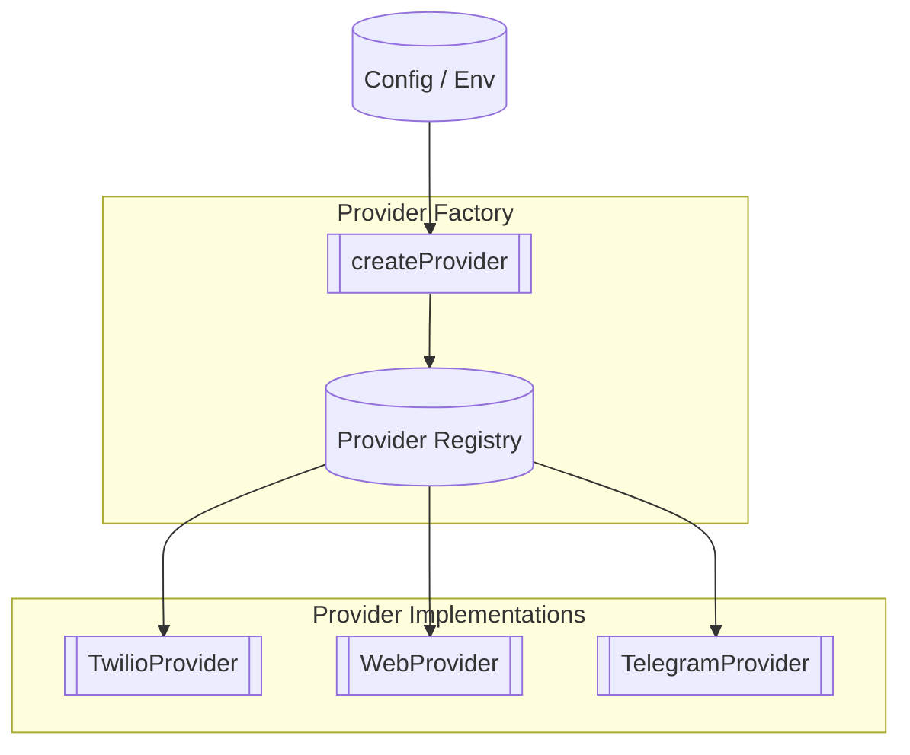

```typescript
// src/providers/factory.ts (proposed)

import type { Provider, ProviderConfig, ProviderKind } from "./types.js";

const providerRegistry = new Map<ProviderKind, new () => Provider>();

export function registerProvider(kind: ProviderKind, ctor: new () => Provider) {
  providerRegistry.set(kind, ctor);
}

export async function createProvider(config: ProviderConfig): Promise<Provider> {
  const ProviderClass = providerRegistry.get(config.kind);
  if (!ProviderClass) {
    throw new Error(`Unknown provider: ${config.kind}`);
  }
  const provider = new ProviderClass();
  await provider.initialize(config);
  return provider;
}

export function getAvailableProviders(): ProviderKind[] {
  return [...providerRegistry.keys()];
}
```

### 4.3 Unified Message Model

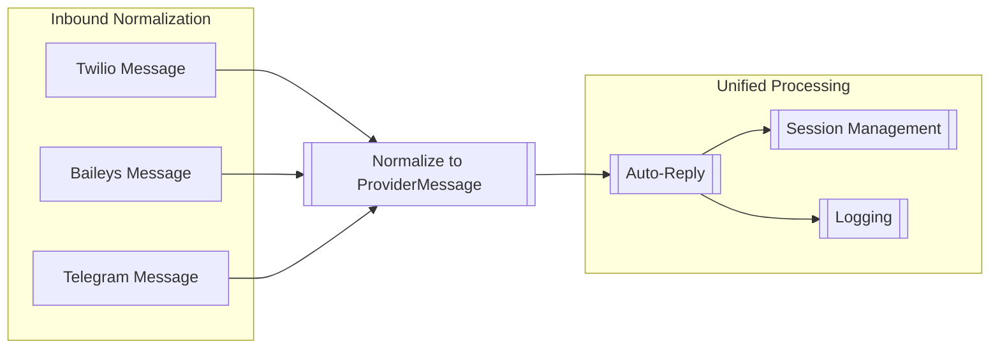

**Caption:** All provider messages normalized to common format before processing.

### 4.4 Identifier Normalization

```typescript
// src/providers/identifiers.ts (proposed)

export interface NormalizedIdentifier {
  provider: ProviderKind;
  raw: string;            // Original identifier
  normalized: string;     // Provider-specific normalized form
  display: string;        // Human-readable form
}

export function normalizeIdentifier(
  provider: ProviderKind,
  raw: string
): NormalizedIdentifier {
  switch (provider) {
    case "wa-twilio":
    case "wa-web":
      // WhatsApp: E.164 phone number
      const e164 = raw.replace(/^whatsapp:/, "").replace(/[^\d+]/g, "");
      return {
        provider,
        raw,
        normalized: e164.startsWith("+") ? e164 : `+${e164}`,
        display: e164.startsWith("+") ? e164 : `+${e164}`,
      };

    case "telegram":
      // Telegram: numeric user ID or @username
      if (/^\d+$/.test(raw)) {
        return {
          provider,
          raw,
          normalized: raw,
          display: `user:${raw}`,
        };
      }
      if (raw.startsWith("@")) {
        return {
          provider,
          raw,
          normalized: raw.toLowerCase(),
          display: raw,
        };
      }
      return { provider, raw, normalized: raw, display: raw };

    default:
      return { provider, raw, normalized: raw, display: raw };
  }
}
```

---

## 5. Configuration Schema Design

### 5.1 Extended Environment Variables

```bash
# .env.example (extended)

# =============================================================================
# TWILIO (WhatsApp Business API)
# =============================================================================
TWILIO_ACCOUNT_SID=ACxxxxxxxxxxxxxxxxxxxxxxxxxxxxxxxx
TWILIO_AUTH_TOKEN=your_auth_token_here
TWILIO_WHATSAPP_FROM=whatsapp:+17343367101

# =============================================================================
# TELEGRAM (MTProto Client)
# =============================================================================
# Get from https://my.telegram.org/apps
TELEGRAM_API_ID=12345678
TELEGRAM_API_HASH=0123456789abcdef0123456789abcdef
```

### 5.2 Extended clawdis.json Schema

```typescript
// Extended WarelayConfig type

export type TelegramConfig = {
  // Security whitelist (same model as WhatsApp)
  allowFrom?: string[];     // Usernames (@user) or user IDs (123456789)
};

export type WarelayConfig = {
  logging?: LoggingConfig;

  // Provider-specific settings
  web?: WebConfig;
  telegram?: TelegramConfig;

  inbound?: {
    allowFrom?: string[];   // WhatsApp E.164 numbers
    messagePrefix?: string;
    responsePrefix?: string;
    timestampPrefix?: boolean | string;
    transcribeAudio?: { ... };
    reply?: { ... };
  };
};
```

### 5.3 Sample clawdis.json with Telegram

```json5
{
  "logging": {
    "level": "info",
    "file": "~/.clawdis/logs/clawdis.log"
  },

  // Telegram-specific settings
  "telegram": {
    "allowFrom": ["@alice", "@bob", "123456789"]
  },

  // Web relay settings
  "wa-web": {
    "heartbeatSeconds": 300,
    "reconnect": {
      "maxAttempts": 10,
      "initialMs": 1000,
      "maxMs": 30000
    }
  },

  // Shared inbound settings (apply to WhatsApp)
  "inbound": {
    "allowFrom": ["+15551234567"],
    "responsePrefix": "",
    "timestampPrefix": "America/Los_Angeles",
    "reply": {
      "mode": "command",
      "command": ["claude", "-p", "{{Body}}"],
      "timeoutSeconds": 300,
      "session": {
        "scope": "per-sender",
        "idleMinutes": 30,
        "resetTriggers": ["/new", "/reset"]
      }
    }
  }
}
```

### 5.4 Provider Selection Logic (Extended)

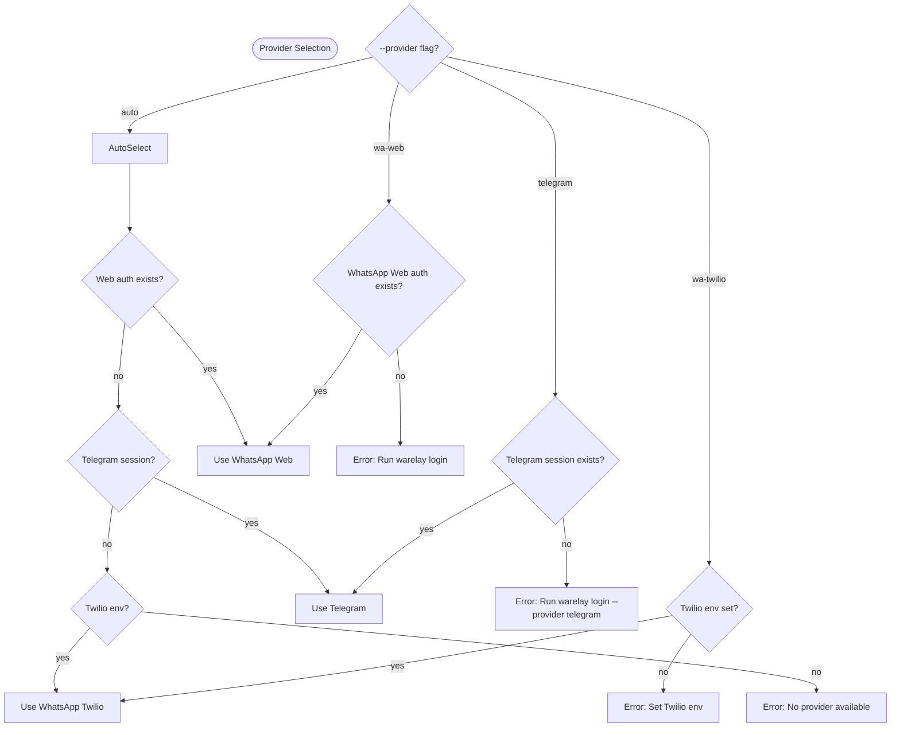

**Caption:** Extended provider selection with Telegram priority between Web and Twilio.

---

## 6. Implementation Roadmap

### 6.1 Phase Overview


### 6.2 Phase 1: Provider Abstraction Refactoring (Week 1-2)

**Goal:** Introduce formal provider interface without breaking existing functionality.

#### Tasks

1. **Create provider interface types**
   - `src/providers/types.ts` - Interface definitions
   - `src/providers/factory.ts` - Provider factory
   - `src/providers/identifiers.ts` - ID normalization

2. **Wrap existing providers**
   - `src/providers/twilio/provider.ts` - TwilioProvider class
   - `src/providers/web/provider.ts` - WebProvider class

3. **Update CLI deps**
   - Modify `src/cli/deps.ts` to use provider factory
   - Keep backward compatibility during transition

4. **Add provider tests**
   - Unit tests for provider interface compliance
   - Integration tests for existing functionality

#### File Structure After Phase 1

```
src/providers/
  types.ts              # NEW: Interface definitions
  factory.ts            # NEW: Provider factory
  identifiers.ts        # NEW: ID normalization
  twilio/
    index.ts            # Existing: Re-exports
    provider.ts         # NEW: TwilioProvider class
  web/
    index.ts            # Existing: Re-exports
    provider.ts         # NEW: WebProvider class
```

### 6.3 Phase 2: Telegram MTProto Provider (Week 3-4)

**Goal:** Implement Telegram MTProto client provider.

#### Tasks

1. **Add Telegram dependencies**
   ```bash
   pnpm add telegram  # GramJS
   pnpm add input     # For interactive login
   ```

2. **Create Telegram provider**
   - `src/providers/telegram/client.ts` - GramJS client wrapper
   - `src/providers/telegram/provider.ts` - TelegramProvider class
   - `src/providers/telegram/session.ts` - Session management
   - `src/providers/telegram/login.ts` - Interactive login flow

3. **Implement core functionality**
   - Send messages (text + media)
   - Receive via persistent connection
   - Session persistence

4. **Add Telegram-specific features**
   - User ID / username resolution
   - `allowFrom` filtering

#### Telegram Provider Structure

```
src/providers/telegram/
  index.ts              # Re-exports
  provider.ts           # TelegramProvider class
  client.ts             # GramJS wrapper
  session.ts            # Session storage
  login.ts              # Interactive login
  media.ts              # Telegram media handling
```

### 6.4 Phase 3: Feature Parity (Week 5)

**Goal:** Full feature parity with WhatsApp Web provider.

#### Tasks

1. **Media support** - Images, audio, video, documents
2. **Auto-reply integration** - Test with Claude agent
3. **Relay mode** - Persistent connection with reconnection
4. **CLI commands** - login, send, relay, status

### 6.5 Phase 4: Documentation and Polish (Week 6)

**Goal:** Complete documentation and edge case handling.

#### Tasks

1. **Documentation** - User guides, API docs, examples
2. **Error handling** - Session expiry, rate limits, network errors
3. **Testing** - Unit, integration, E2E tests

---

## 7. User Experience Design

### 7.1 CLI Command Changes

#### Current Commands (Unchanged)

```bash
# Send (add --provider telegram)
warelay send --to <id> --message "text" --provider telegram

# Relay (add --provider telegram)
warelay relay --provider telegram --verbose
```

#### New Telegram-Specific Commands

```bash
# Login with phone + code + 2FA
warelay login --provider telegram
# Interactive: prompts for phone, code, 2FA password
```

### 7.2 Example Workflows

#### Workflow 1: Send via Telegram

```bash
# One-time setup
export TELEGRAM_API_ID="12345678"
export TELEGRAM_API_HASH="0123456789abcdef..."

# Login (once)
warelay login --provider telegram
# Enter phone: +15551234567
# Enter code: 12345
# Enter 2FA password: ********

# Send message
warelay send --provider telegram --to @john_doe --message "Hello from warelay!"

# Send with media
warelay send --provider telegram --to @john_doe --message "Check this" --media ./photo.jpg
```

#### Workflow 2: Telegram Relay Mode

```bash
# Start relay (persistent connection)
warelay relay --provider telegram --verbose

# Output:
# warelay 1.4.0 - Telegram @yourusername listening
# logs: /tmp/warelay/warelay.log (level info)
# Ready to receive messages!
```

### 7.3 Provider Comparison Guide

| Scenario | Provider | Command |
|----------|----------|---------|
| Personal WhatsApp | `wa-web` | `--provider wa-web` |
| Business WhatsApp | `wa-twilio` | `--provider wa-twilio` |
| Personal Telegram | `telegram` | `--provider telegram` |
| Auto (prefer personal) | `auto` | `--provider auto` |

### 7.4 Migration Guide for Existing Users

1. **No changes required** for existing WhatsApp Twilio or WhatsApp Web users (legacy names `twilio` and `web` still work)
2. **To add Telegram:**
   - Get API credentials from https://my.telegram.org/apps
   - Set `TELEGRAM_API_ID` and `TELEGRAM_API_HASH` environment variables
   - Run `warelay login --provider telegram`
   - Use `--provider telegram` flag
3. **Configuration file** is backward compatible
4. **Auto mode** will include Telegram in priority chain

---

## 8. Design Decisions

### ADR-001: MTProto Client Approach

**Status:** Accepted

**Context:** warelay is a personal automation tool - a butler for the user's own account. Users want to automate their personal Telegram conversations, not run a bot.

**Decision:** Use MTProto client (GramJS) for personal account access.

**Consequences:**
- Matches WhatsApp Web provider pattern exactly
- Can initiate conversations
- Full access to personal DMs
- Same `allowFrom` security model works
- Requires phone + code + 2FA login

### ADR-002: GramJS Library Selection

**Status:** Accepted

**Context:** Multiple Node.js libraries exist for Telegram MTProto.

| Library | TypeScript | Active | Pattern |
|---------|------------|--------|---------|
| telegram (GramJS) | Native | Yes | Similar to Baileys |
| mtproto-core | Types available | Moderate | Low-level |

**Decision:** Use GramJS (`telegram` npm package) for native TypeScript support and similarity to Baileys patterns.

**Consequences:**
- Clean TypeScript integration
- Familiar patterns for Baileys users
- Active maintenance
- Good documentation

### ADR-003: Session Storage Location

**Status:** Accepted

**Context:** Need to store Telegram session like WhatsApp Web credentials.

**Decision:** Store at `~/.clawdis/telegram/session/` following existing patterns.

**Consequences:**
- Consistent with `~/.clawdis/credentials/` for WhatsApp
- User-specific storage
- Easy to backup/restore
- Clear separation between providers

---

## Appendix A: File Evidence Index

| Section | Files Referenced |
|---------|-----------------|
| Provider Types | `src/utils.ts:L9-L14`, `src/providers/provider.types.ts:L1-L2` |
| Twilio Implementation | `src/twilio/send.ts`, `src/twilio/monitor.ts`, `src/twilio/client.ts` |
| Web Implementation | `src/web/session.ts`, `src/web/outbound.ts`, `src/web/inbound.ts` |
| CLI Commands | `src/cli/program.ts`, `src/commands/send.ts`, `src/commands/status.ts` |
| Configuration | `src/config/config.ts`, `src/env.ts`, `.env.example` |
| Dependencies | `src/cli/deps.ts` |

## Appendix B: Glossary

| Term | Definition |
|------|------------|
| Baileys | Open-source WhatsApp Web client library |
| GramJS | TypeScript Telegram MTProto client library |
| MTProto | Telegram's native binary protocol for user clients |
| User ID | Telegram's numeric identifier for users |
| E.164 | International phone number format (+1234567890) |
| JID | Jabber/WhatsApp ID format (number@s.whatsapp.net) |
| Provider | Messaging backend (Twilio, Web, Telegram) |
| Session | Authenticated state stored on disk |

## Appendix C: Related Documentation

- [GramJS Documentation](https://gram.js.org/)
- [Telegram API Documentation](https://core.telegram.org/api)
- [Twilio WhatsApp API](https://www.twilio.com/docs/whatsapp)
- [Baileys Documentation](https://github.com/WhiskeySockets/Baileys)
