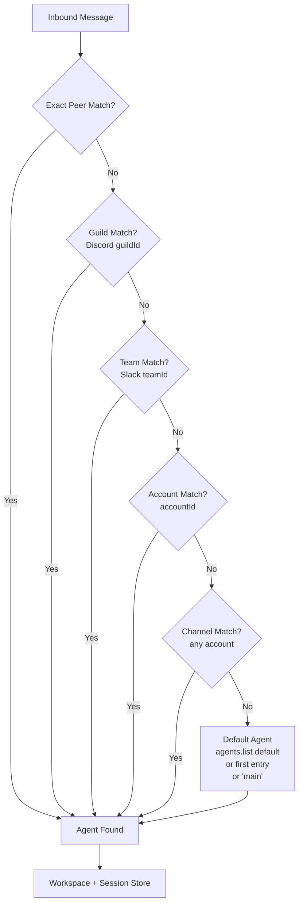
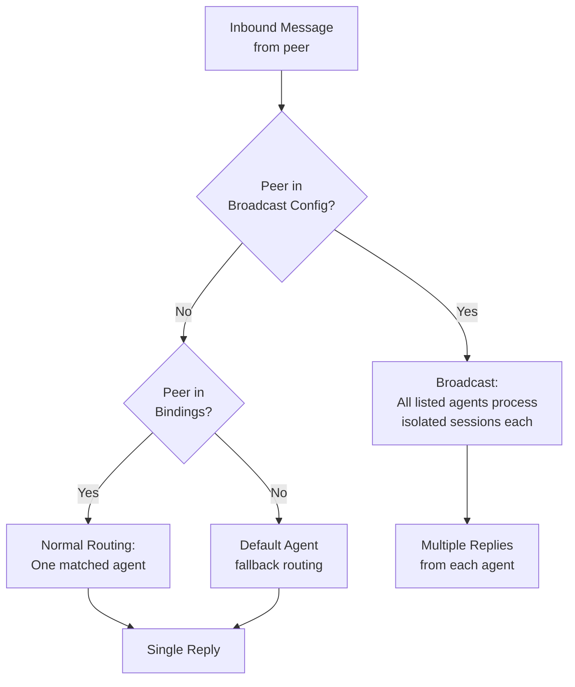

# Channels & routing


Moltbot routes replies **back to the channel where a message came from**. The
model does not choose a channel; routing is deterministic and controlled by the
host configuration.

## Key terms

- **Channel**: `whatsapp`, `telegram`, `discord`, `slack`, `signal`, `imessage`, `webchat`.
- **AccountId**: per‑channel account instance (when supported).
- **AgentId**: an isolated workspace + session store (“brain”).
- **SessionKey**: the bucket key used to store context and control concurrency.

## Session key shapes (examples)

Direct messages collapse to the agent’s **main** session:

- `agent:<agentId>:<mainKey>` (default: `agent:main:main`)

Groups and channels remain isolated per channel:

- Groups: `agent:<agentId>:<channel>:group:<id>`
- Channels/rooms: `agent:<agentId>:<channel>:channel:<id>`

Threads:

- Slack/Discord threads append `:thread:<threadId>` to the base key.
- Telegram forum topics embed `:topic:<topicId>` in the group key.

Examples:

- `agent:main:telegram:group:-1001234567890:topic:42`
- `agent:main:discord:channel:123456:thread:987654`

## Routing rules (how an agent is chosen)

Routing picks **one agent** for each inbound message:

1. **Exact peer match** (`bindings` with `peer.kind` + `peer.id`).
2. **Guild match** (Discord) via `guildId`.
3. **Team match** (Slack) via `teamId`.
4. **Account match** (`accountId` on the channel).
5. **Channel match** (any account on that channel).
6. **Default agent** (`agents.list[].default`, else first list entry, fallback to `main`).

The matched agent determines which workspace and session store are used.


<details>
<summary>Diagram source (Mermaid)</summary>



</details>

## Broadcast groups (run multiple agents)

Broadcast groups let you run **multiple agents** for the same peer **when Moltbot would normally reply** (for example: in WhatsApp groups, after mention/activation gating).

Config:

```json5
{
  broadcast: {
    strategy: "parallel",
    "120363403215116621@g.us": ["alfred", "baerbel"],
    "+15555550123": ["support", "logger"]
  }
}
```

See: [Broadcast Groups](/broadcast-groups).


<details>
<summary>Diagram source (Mermaid)</summary>



</details>

## Config overview

- `agents.list`: named agent definitions (workspace, model, etc.).
- `bindings`: map inbound channels/accounts/peers to agents.

Example:

```json5
{
  agents: {
    list: [
      { id: "support", name: "Support", workspace: "~/clawd-support" }
    ]
  },
  bindings: [
    { match: { channel: "slack", teamId: "T123" }, agentId: "support" },
    { match: { channel: "telegram", peer: { kind: "group", id: "-100123" } }, agentId: "support" }
  ]
}
```

## Session storage

Session stores live under the state directory (default `~/.clawdbot`):

- `~/.clawdbot/agents/<agentId>/sessions/sessions.json`
- JSONL transcripts live alongside the store

You can override the store path via `session.store` and `{agentId}` templating.

## WebChat behavior

WebChat attaches to the **selected agent** and defaults to the agent’s main
session. Because of this, WebChat lets you see cross‑channel context for that
agent in one place.

## Reply context

Inbound replies include:
- `ReplyToId`, `ReplyToBody`, and `ReplyToSender` when available.
- Quoted context is appended to `Body` as a `[Replying to ...]` block.

This is consistent across channels.
