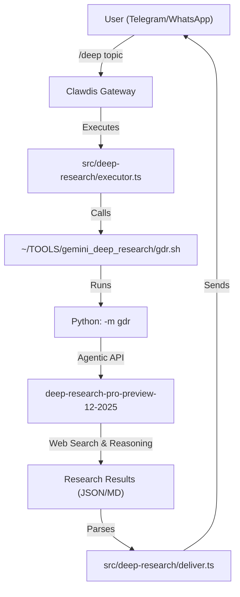
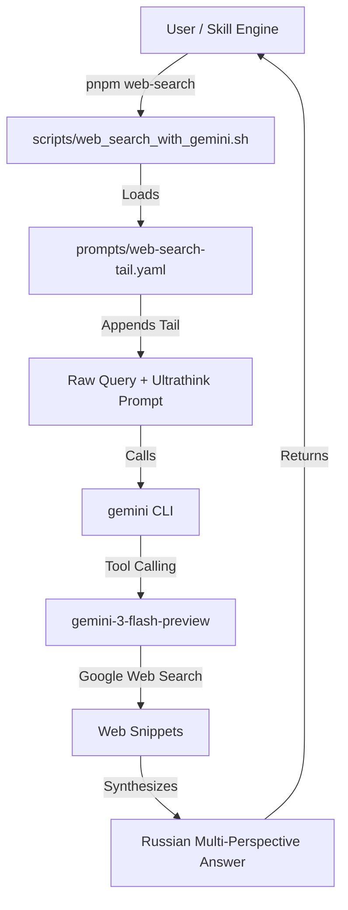

# Deep Research vs. Web Search: Pipeline Comparison

This document provides a technical comparison between two distinct research pipelines implemented in the Clawdis project: the **Slash Command (`/deep`)** and the **CLI Skill (`web-search`)**.

---

## 📊 Quick Comparison

| Feature | Slash Command (`/deep`) | CLI Skill (`web-search`) |
| :--- | :--- | :--- |
| **Backend Model** | `deep-research-pro-preview-12-2025` | `gemini-3-flash-preview` |
| **API Type** | Agentic "Interactions" API (v1beta) | Standard Chat/Tool API |
| **Workflow** | Autonomous Multi-step Agent | Prompt-Engineered Search + LLM |
| **Execution** | Python Wrapper (`gdr.sh`) | Bash Wrapper (`web_search_with_gemini.sh`) |
| **Persistence** | Long-running runs (up to 20m) | Rapid request-response |
| **Output** | Formal report + Summary + Opinions | Multi-perspective Russian response |

---

## 🛠️ Pipeline Architectures

### 1. Slash Command Pipeline (`/deep`)
The `/deep` command triggers a high-tier, agentic research process. It is designed for exhaustive investigations where the model autonomously navigates the web, aggregates data, and synthesizes a professional-grade report.

### 2. CLI Skill Pipeline (`web-search`)
The `web-search` skill is a lightweight, efficient wrapper optimized for quick research with a specific persona and language constraint. It relies on the robust tool-calling capabilities of the Flash-tier models.

---

## 🔍 Key Technical Differences

### The Agentic API vs. Tool Calling
*   **Slash Command (`/deep`)**: Uses the **Google "Interactions" API**. This is an asynchronous API where the model acts as an agent. It can spend significant time "thinking" and performing multiple sequential searches before returning a final state. It is a "Deep Research" product in itself.
*   **CLI Skill (`web-search`)**: Uses standard **synchronous tool calling**. The model receives the search tool, calls it, and produces an answer in a single flow. Its power comes from the **Ultrathink** prompt tail which forces a "collective multi-perspective reasoning" persona.

### Implementation Stack
*   **`/deep`**: Integrated into the TypeScript gateway via `spawn` calls to a Python-based module. It handles complex event streams (`run.complete`, `publish.error`) and supports rich progress updates in the chat UI.
*   **`web-search`**: A standalone bash utility that can be used independently or as a skill. It focuses on output format (JSON) and prompt injection, making it highly portable.

---

## 🏁 Conclusion

*   **Use `/deep`** when you need a "Paid Agent" experience—exhaustive reports, exhaustive citations, and the highest level of autonomous research provided by Google's specialized agentic models.
*   **Use `web-search`** for rapid, high-quality summaries, multi-perspective analysis, and strictly localized Russian output. It is the "fast and smart" alternative that leverages the latest Flash-tier performance.
