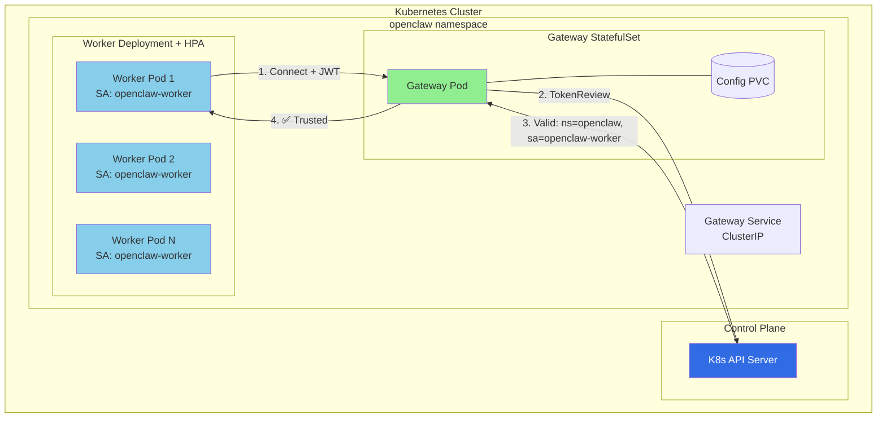
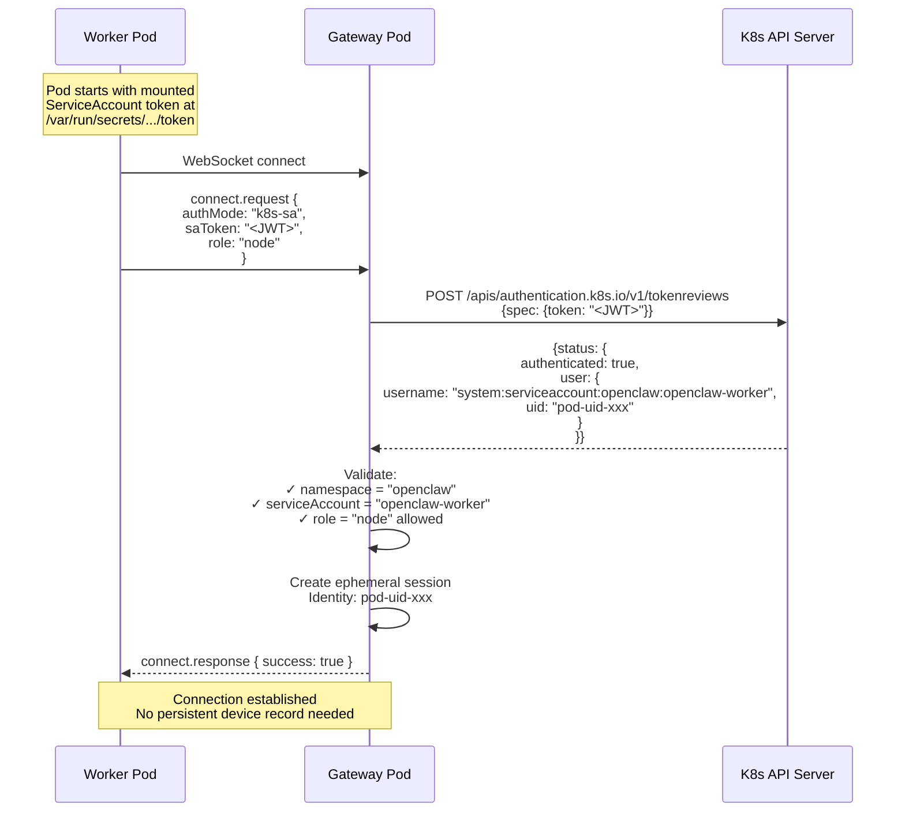
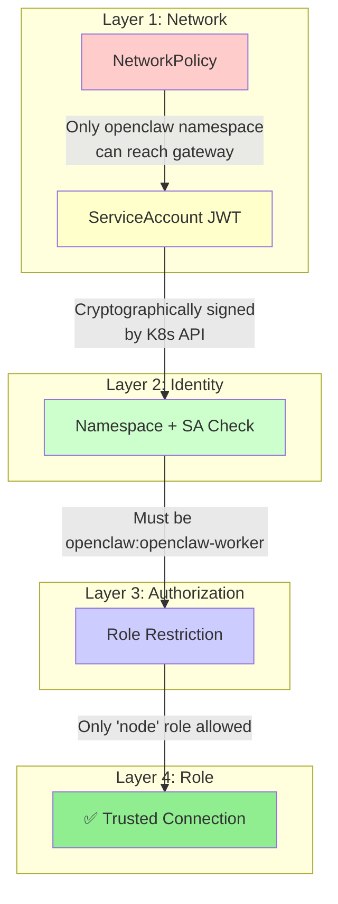
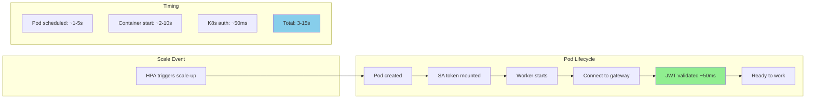

# OpenClaw Kubernetes: Service Account Trust Architecture

**Target:** Production Kubernetes with HorizontalPodAutoscaler  
**Security Model:** Kubernetes Service Account Trust (Zero shared secrets)

---

## Quick Start

### Option A: Raw Manifests

```bash
# Build and load the OpenClaw image
docker build -t localhost/openclaw:local .
# For K3s: sudo k3s ctr images import <(docker save localhost/openclaw:local)
# For Kind: kind load docker-image localhost/openclaw:local

# Create namespace and generate gateway token
kubectl apply -f deploy/k8s/namespace.yaml
kubectl -n openclaw create secret generic openclaw-gateway-token \
  --from-literal=token="$(openssl rand -hex 32)"

# Deploy all components
kubectl apply -f deploy/k8s/

# Verify deployment
kubectl -n openclaw get pods -w
```

### Option B: Helm Chart

```bash
# Install with default values
helm install openclaw deploy/helm/openclaw -n openclaw --create-namespace

# Or customize with your values
helm install openclaw deploy/helm/openclaw -n openclaw --create-namespace \
  -f deploy/helm/openclaw/values-local.yaml \
  --set gateway.token="$(openssl rand -hex 32)"

# Upgrade after changes
helm upgrade openclaw deploy/helm/openclaw -n openclaw
```

### Verify Deployment

```bash
# Check all pods are running
kubectl -n openclaw get pods

# Watch worker scaling
kubectl -n openclaw get hpa -w

# View gateway logs
kubectl -n openclaw logs -f statefulset/openclaw-gateway

# Port-forward to access Control UI
kubectl -n openclaw port-forward svc/openclaw-gateway 18789:18789
```

### Scale Workers

```bash
# Manual scale
kubectl -n openclaw scale deployment/openclaw-worker --replicas=5

# Or let HPA handle it based on CPU (default: 70% threshold)
kubectl -n openclaw get hpa openclaw-worker
```

---

## Design Principles

1. **No shared secrets** - Use K8s-native identity (ServiceAccount tokens)
2. **Zero-trust networking** - Validate every connection, even from pod network
3. **Least privilege** - Workers get only "node" role capabilities
4. **Automatic revocation** - Pod deletion = immediate access revocation
5. **Auditable** - Every connection traceable to specific pod

---

## Architecture



---

## Authentication Flow



---

## Security Model

### Trust Chain



### Why This Is Secure

| Property                   | How SA Trust Achieves It                           |
| -------------------------- | -------------------------------------------------- |
| **No shared secrets**      | Each pod has unique, auto-rotated JWT              |
| **Cryptographic identity** | JWT signed by K8s CA, unforgeable                  |
| **Automatic rotation**     | K8s rotates tokens automatically (default: 1 hour) |
| **Instant revocation**     | Pod deletion = token immediately invalid           |
| **Per-pod tracking**       | Each connection maps to specific pod UID           |
| **Namespace isolation**    | Can only trust specific namespace(s)               |
| **Defense in depth**       | NetworkPolicy + JWT + namespace + SA + role        |

### Attack Scenarios

| Attack                       | Mitigation                                          |
| ---------------------------- | --------------------------------------------------- |
| Token stolen from pod        | Token only valid from that pod's IP (K8s binding)   |
| Compromised pod connects     | Valid - but traceable, and limited to "node" role   |
| Pod impersonates another     | JWT contains pod UID - can't forge                  |
| External attacker with token | NetworkPolicy blocks, JWT audience wrong            |
| Replay old token             | Tokens expire (1 hour default), API rejects expired |
| MITM in cluster              | Use mTLS (optional enhancement)                     |

---

## Manifest Files

All Kubernetes manifests are in [`deploy/k8s/`](https://github.com/openclaw/openclaw/tree/main/deploy/k8s):

| File | Description |
|------|-------------|
| [namespace.yaml](https://github.com/openclaw/openclaw/blob/main/deploy/k8s/namespace.yaml) | `openclaw` namespace |
| [rbac.yaml](https://github.com/openclaw/openclaw/blob/main/deploy/k8s/rbac.yaml) | ServiceAccounts + ClusterRole for TokenReview |
| [gateway-config.yaml](https://github.com/openclaw/openclaw/blob/main/deploy/k8s/gateway-config.yaml) | ConfigMap with k8sTrust config + Secret template |
| [gateway.yaml](https://github.com/openclaw/openclaw/blob/main/deploy/k8s/gateway.yaml) | Gateway StatefulSet + Service |
| [worker.yaml](https://github.com/openclaw/openclaw/blob/main/deploy/k8s/worker.yaml) | Worker Deployment + HPA |
| [networkpolicy.yaml](https://github.com/openclaw/openclaw/blob/main/deploy/k8s/networkpolicy.yaml) | Network isolation rules |

For Helm chart, see [`deploy/helm/openclaw/`](https://github.com/openclaw/openclaw/tree/main/deploy/helm/openclaw).

---

## Implementation

Source code for K8s SA Trust authentication:

| File | Description |
|------|-------------|
| [src/gateway/k8s-auth.ts](https://github.com/openclaw/openclaw/blob/main/src/gateway/k8s-auth.ts) | `K8sAuthenticator` class - TokenReview API calls |
| [src/config/types.gateway.ts](https://github.com/openclaw/openclaw/blob/main/src/config/types.gateway.ts) | K8sTrust config type definitions |

### CLI Usage

Workers connect with the `--k8s-trust` flag:

```bash
openclaw node run --host openclaw-gateway --port 18789 --k8s-trust
```

---

## Configuration

Gateway config with K8s SA Trust enabled (see [gateway-config.yaml](https://github.com/openclaw/openclaw/blob/main/deploy/k8s/gateway-config.yaml)):

```json
{
  "gateway": {
    "mode": "local",
    "port": 18789,
    "bind": "lan",
    "auth": {
      "mode": "token",
      "k8sTrust": {
        "enabled": true,
        "allowedIdentities": [
          {
            "namespace": "openclaw",
            "serviceAccount": "openclaw-worker",
            "allowedRoles": ["node"]
          }
        ],
        "ephemeralSessions": true,
        "auditLog": true
      }
    }
  }
}
```

### Configuration Options

| Option | Type | Description |
|--------|------|-------------|
| `enabled` | boolean | Enable K8s SA Trust authentication |
| `allowedIdentities` | array | List of namespace/serviceAccount/roles allowed to connect |
| `ephemeralSessions` | boolean | Don't persist device records for K8s workers |
| `auditLog` | boolean | Log all K8s auth events |

---

## Monitoring & Observability

### Grafana Dashboard Queries

```promql
# Auth success rate
rate(openclaw_k8s_auth_attempts_total{result="success"}[5m])
/ rate(openclaw_k8s_auth_attempts_total[5m])

# Active workers by namespace
openclaw_k8s_sessions_active

# Failed auth attempts (alert worthy)
increase(openclaw_k8s_auth_attempts_total{result="failed"}[5m]) > 0
```

### Audit Log Format

```json
{
  "timestamp": "2026-02-08T12:00:00Z",
  "event": "k8s-auth-success",
  "namespace": "openclaw",
  "serviceAccount": "openclaw-worker",
  "podUid": "abc123-def456",
  "role": "node",
  "remoteIp": "10.244.1.5",
  "displayName": "openclaw-workers-7b8c9-xkl2m"
}
```

---

## Scaling Characteristics



**Key Scaling Properties:**

- New workers ready in **3-15 seconds** (dominated by pod scheduling)
- **Zero pre-registration** - JWT is the identity
- **Linear scaling** - No gateway state per worker needed
- **Graceful scale-down** - Sessions cleaned when pod terminates

---

## Comparison: SA Trust vs Device Pairing

| Aspect           | Device Pairing             | K8s SA Trust                |
| ---------------- | -------------------------- | --------------------------- |
| Identity source  | Generated keypair          | K8s ServiceAccount          |
| Persistence      | Required (devices/\*.json) | None (ephemeral)            |
| Revocation       | Manual approval removal    | Automatic on pod delete     |
| Scaling          | Manual approve each        | Zero-touch                  |
| Blast radius     | Per-device                 | Per-pod                     |
| Rotation         | Manual                     | Automatic (K8s handles)     |
| Audit trail      | Device ID                  | Pod UID + namespace + SA    |
| External clients | ✅ Supported               | ❌ K8s only                 |
| Complexity       | Lower                      | Higher (K8s API dependency) |

---

## Troubleshooting

### Error 1008: Token Mismatch

**Symptom:** Control UI shows "token mismatch" error after Helm deploy/upgrade.

**Root Cause:** Helm doesn't overwrite existing secrets by default. If you manually generate a token during deploy but the secret already exists, the displayed token won't match the actual secret.

**Solution:** Get the actual token from the secret:

```bash
kubectl -n <namespace> get secret <release>-openclaw-gateway-token \
  -o jsonpath='{.data.token}' | base64 -d && echo
```

**Prevention:** Use the deploy script which automatically reads existing tokens on upgrade:

```bash
# Fresh install: generates new token
# Upgrade: reads existing token from secret
./deploy-helm.sh <name>
```

**Force Token Rotation:** Delete the secret before deploying:

```bash
kubectl -n <namespace> delete secret <release>-openclaw-gateway-token
./deploy-helm.sh <name>
```

### ImagePullBackOff

**Symptom:** Pods stuck in `ImagePullBackOff` or `ErrImagePull`.

**Cause:** Default Helm values expect a public image, but for local development you need the local image.

**Solution:** Use local values or set image explicitly:

```bash
# Option A: Use local values file
helm upgrade <name> deploy/helm/openclaw -n <namespace> \
  -f deploy/helm/openclaw/values-local.yaml

# Option B: Set image directly
helm upgrade <name> deploy/helm/openclaw -n <namespace> \
  --set image.repository=localhost/openclaw \
  --set image.tag=local \
  --set image.pullPolicy=Never
```

### Workers CrashLoopBackOff

**Symptom:** Workers restart repeatedly with `ECONNREFUSED`.

**Cause:** Workers started before gateway was ready.

**Solution:** Wait for gateway to be ready, workers will auto-recover:

```bash
kubectl -n <namespace> rollout status statefulset/<release>-openclaw-gateway
```

---

## Summary

**K8s ServiceAccount Trust is the production-recommended approach for Kubernetes deployments because:**

1. ✅ **No shared secrets** - Eliminates secret management overhead
2. ✅ **Automatic rotation** - K8s handles token lifecycle
3. ✅ **Instant revocation** - Pod deletion = immediate access loss
4. ✅ **Per-pod identity** - Full audit trail to specific workload
5. ✅ **Zero-touch scaling** - HPA works without any manual steps
6. ✅ **K8s-native** - Leverages existing RBAC and identity infrastructure
7. ✅ **Defense in depth** - NetworkPolicy + JWT + namespace + SA + role
