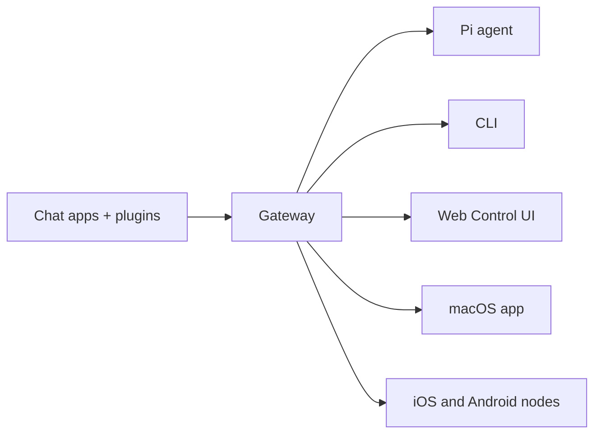

# OpenClaw 🦞

<p align="center">
    
    
</p>

> _"탈피하라! 탈피하라!"_ — 아마도 우주 랍스터

<p align="center">
  <strong>WhatsApp, Telegram, Discord, iMessage 등을 하나의 Gateway로 연결하는 AI 에이전트 플랫폼</strong><br />
  메시지를 보내면 언제든지 에이전트 응답을 받을 수 있습니다.
</p>

<Note>
한국어 문서는 현재 초기 번역 단계입니다. 번역되지 않은 페이지는 영어 문서를 참고하세요.
</Note>

<Columns>
  <Card title="시작하기" href="/start/getting-started" icon="rocket">
    OpenClaw를 설치하고 몇 분 안에 Gateway를 실행하세요.
  </Card>
  <Card title="온보딩 실행" href="/start/wizard" icon="sparkles">
    `openclaw onboard`로 권장 설정을 빠르게 완료하세요.
  </Card>
  <Card title="Control UI 열기" href="/web/control-ui" icon="layout-dashboard">
    브라우저 대시보드에서 채팅, 설정, 세션을 관리하세요.
  </Card>
</Columns>

## OpenClaw란?

OpenClaw는 **셀프 호스팅 Gateway**로, WhatsApp, Telegram, Discord, iMessage 같은
메신저를 Pi 같은 AI 코딩 에이전트와 연결합니다. 하나의 Gateway 프로세스를 직접
실행하면 메시지 앱과 AI 어시스턴트를 안정적으로 연결할 수 있습니다.

핵심 특징:

- **셀프 호스팅**: 내 장비에서, 내 정책으로 운영
- **멀티 채널**: 하나의 Gateway로 여러 채널 동시 연결
- **에이전트 중심 설계**: 세션, 메모리, 도구 호출, 멀티 에이전트 라우팅 지원
- **오픈소스**: MIT 라이선스

## 동작 방식



Gateway는 세션, 라우팅, 채널 연결 상태를 관리하는 중앙 허브입니다.

## 핵심 기능

<Columns>
  <Card title="멀티 채널 Gateway" icon="network">
    단일 Gateway 프로세스로 여러 메시징 채널을 운영할 수 있습니다.
  </Card>
  <Card title="플러그인 채널" icon="plug">
    확장 패키지로 Mattermost 등 추가 채널을 연결할 수 있습니다.
  </Card>
  <Card title="멀티 에이전트 라우팅" icon="route">
    에이전트, 워크스페이스, 발신자 단위로 세션을 분리할 수 있습니다.
  </Card>
  <Card title="미디어 지원" icon="image">
    이미지, 오디오, 문서 송수신을 지원합니다.
  </Card>
  <Card title="Web Control UI" icon="monitor">
    브라우저에서 채팅, 설정, 세션, 노드 상태를 확인합니다.
  </Card>
  <Card title="모바일 노드" icon="smartphone">
    iOS/Android 노드 페어링과 Canvas 기능을 지원합니다.
  </Card>
</Columns>

## 빠른 시작

<Steps>
  <Step title="OpenClaw 설치">
    ```bash
    npm install -g openclaw@latest
    ```
  </Step>
  <Step title="온보딩 실행 및 서비스 설치">
    ```bash
    openclaw onboard --install-daemon
    ```
  </Step>
  <Step title="WhatsApp 페어링 및 Gateway 시작">
    ```bash
    openclaw channels login
    openclaw gateway --port 18789
    ```
  </Step>
</Steps>

전체 설치/개발 설정은 [Quick start](/start/quickstart)를 확인하세요.

## 대시보드

Gateway 시작 후 브라우저 Control UI를 엽니다.

- 로컬 기본 주소: [http://127.0.0.1:18789/](http://127.0.0.1:18789/)
- 원격 접근: [Web surfaces](/web), [Tailscale](/gateway/tailscale)

<p align="center">
  
</p>

## 설정 (선택)

설정 파일 경로: `~/.openclaw/openclaw.json`

- 기본값을 그대로 두면 내장 Pi 바이너리가 RPC 모드로 실행됩니다.
- 접근 제어를 강화하려면 `channels.whatsapp.allowFrom`과 그룹 멘션 규칙부터 설정하세요.

예시:

```json5
{
  channels: {
    whatsapp: {
      allowFrom: ["+15555550123"],
      groups: { "*": { requireMention: true } },
    },
  },
  messages: { groupChat: { mentionPatterns: ["@openclaw"] } },
}
```

## 다음 단계

<Columns>
  <Card title="문서 허브" href="/start/hubs" icon="book-open">
    주제별 문서 모음을 통해 필요한 가이드를 빠르게 찾을 수 있습니다.
  </Card>
  <Card title="Gateway 설정" href="/gateway/configuration" icon="settings">
    인증, 토큰, 공급자 설정을 확인하세요.
  </Card>
  <Card title="채널 연결" href="/channels/telegram" icon="message-square">
    채널별 설정 문서를 보고 WhatsApp/Telegram/Discord 등을 연결하세요.
  </Card>
  <Card title="도움말" href="/help" icon="life-buoy">
    자주 발생하는 문제와 트러블슈팅 경로를 확인하세요.
  </Card>
</Columns>
